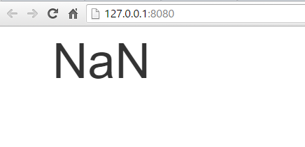

# ECMAScript 2015 Features {#ecmascript-features}

In the last chapter, I mentioned that in addition to adding static typing to the JavaScript language, TypeScript also provides the ability to leverage a handful of ECMAScript 2015 and next-generation ECMAScript features that aren't yet widely supported and compile them down to ES5-compatible JavaScript that will run in all of today's browsers.  In this chapter I'm going to walk through each of those ECMAScript features in detail, showing you how each feature works and why you might want to use it in your application.  

Notice how I said "might want to use it" -- as you read these next few sections, you may notice that I'll use the term "syntactic sugar" quite a bit.  When I say that something is "syntactic sugar", what I mean is that they do not change the functionality of your application at all.  They are simply nice, clean ways to express logic that would otherwise take many more keystrokes to write out using the previous ES5 language syntax. 

Keep in mind, however, that even though these features are a very nice way to write clean, concise JavaScript - and I will be using most of them in the sample code that I write throughout this book - nothing I'm about to show you is required in order to leverage TypeScript's static typing abilities.  What's more, each of these features are independent of each other which means that you don't need to learn one feature in order to leverage another feature.  Just learn the features that seem like they might have some value to you and ignore the rest. 

So, if you are really eager to jump directly into the unique static typing approach that only TypeScript offers, you can feel free to skip any section in this chapter - or even the entire chapter - and then come back and read them later.  They'll be here waiting for you!

## Optional Parameters {#optional-parameters}

The first  ECMAScript 2015 feature I'll demonstrate is called "optional parameters".  Just as its name implies, the optional parameter syntax allows you to specify a default value for a given parameter in the case that a value is not explicitly passed in.

Take this function, which counts down from an initial number to a final number at a given interval, and it accepts all three of these values as parameters.

	var container = document.getElementById('container');
	
	function countdown(initial, final, interval) {
	
		var current = initial;
		
		while(current > final) {
	               container.innerHTML = current;
		    current -= interval;
		}
	
	}

The nice thing about this function is that it is very customizable: since all of the variables are exposed as parameters on the function I am able to pass in any values I like for the initial value, the final value, and the interval.

However, let's say that as I start using this function throughout my application I find that I'm always counting down to 0 with an interval of 1.  In other words, I'm almost always passing in 0 and 1 as the values for the last two parameters, like this:

	countdown(10, 0, 1)

Notice how I said "almost always", meaning that there are still some cases where I do want to be able to specify how far down to count or how quickly to do it by passing in values for the last two parameters rather than simply hard-coding them.

This is the perfect scenario for optional parameters.  

I can specify that a parameter is "optional" by simply adding "equals" after the parameter name and then specifying the default value that should be used if the caller omits that parameter:

{linenos=on}
~~~
function countdown(initial, final = 0, interval = 1) {

    var current = initial;
    
    while(current > final) {
        container.innerHTML = current;
        current -= interval;
    }

}
~~~

If we take a look at the ES5-compatible JavaScript code that is generated - especially lines 3 & 4 - we can see that the compiler has added a check for each parameter to see if the caller of the function provided a value for that parameter by looking to see if the value is "void" or not.  When it sees that the parameter was omitted, it initializes the value of that variable to the default value.

With this change in place, I can now call the countdown function by only passing in one parameter:

	countdown(10)

And when I do this, the final parameter will default to `0` and the interval parameter with default to `1`.  

Then, in the cases where I want to specify the final parameter, I can do so:

	countdown(10, 4)

And the interval parameter will still default to `0`.

Of course, I can still call the function by passing in all three parameters, just as before:

	countdown(10, 4, 2)
	
As this simple example shows, optional parameters and default values are a nice bit of syntactic sugar that can really help make your code cleaner and easier to read.

## Template Strings {#template-strings}

In this section I'm going to demonstrate one of my favorite ECMAScript features: **template strings**.  
Template strings are an incredibly simple but surprisingly powerful bit of syntactic sugar to help you in those scenarios when you want to construct a string that includes the values of your variables.

Here's a really simple example:

	var todo = {
	    id: 123,
	    name: "Pick up drycleaning",
	    completed: true
	}
	
	var displayName = `Todo #${todo.id}`;

The first thing to notice is the syntax.  In JavaScript, there are two ways to define a string literal value: you can wrap the text in single or double quotes.  In order to define a string template you use the backtick symbol - that one right next to your 1 key that you've never used for anything else.  Inside the template you can write whatever string literal you want, just like a normal string literal, except for when you want to inject a value - that's when you open up an expression by typing "dollar open bracket".  You close the expression by closing the bracket.  Inside of those brackets you can put whatever JavaScript expression you like, and the result will be rendered at that place in the string.

If you take a look at the ES5 that this gets compiled down to, it makes a whole lot more sense:

	"Hello, " + name;
	
Looking at this compiled code with such a simple example also makes this syntax seems a little silly, but it gets a whole lot more interesting when you consider a more real-world example.  For instance, let's assume we want to use this chunk of HTML as a template to render the details of a Todo:

    

        <i class="[[ If Todo is complete, then "hidden" ]] text-success glyphicon glyphicon-ok"></i>
        [[Name]]
    

Previously, I might implement this template by reading this from the DOM and then doing a search-and-replace operation to insert the various bits of logic and data such as the Todo ID, Todo Name, and dynamically applying the "hidden" class to hide the "success" icon on the second line when the todo is not yet completed.

So, let's avoid all of that by converting this into a string template instead.

The first thing to do is wrap the HTML in backticks.

	container.innerHTML =  `
        

            <i class="[[ If Todo is complete, then "hidden" ]] text-success glyphicon glyphicon-ok"></i>
            [[Name]]
        

	`
    
Notice how the string template spans multiple lines.  You don't have to do anything special, just hit enter and keep on typing.  

Also, the fact that this syntax leverages the backtick symbol to open and close the template means that you're free to use the single- and double-quotes inside of the template, just like any other character.

Then, rather than doing those search-and-replace operations, we can insert the values that we want directly into the template using the "dollar-bracket" syntax, like this:

	var todo = {
	    id: 123,
	    name: "Pick up drycleaning",
	    completed: true
	}
	
	container.innerHTML = `
	    

	        <i class="[[ If Todo is complete, then "hidden" ]] text-success glyphicon glyphicon-ok"></i>
	        ${todo.name}
	    

	`
	
One of the cool things about string templates is that you don't have to restrict yourself to simple variable replacements.  You can actually put more complex statements in that will be evaluated.

For example, I can figure out whether or not to render the "hidden" class on the icon element dynamically by introducing a conditional statement right there in the expression, like this:

	container.innerHTML = `
	    

	        <i class="${ todo.completed ? "" : "hidden" } text-success glyphicon glyphicon-ok"></i>
	        ${todo.name}
	    

	`

When the value of todo.completed is true, the expression will evaluate to an empty string and no CSS class will be applied;  when the value is false, the expression will output the string "hidden", which will be rendered along with the rest of the CSS classes in the template.

{title="app.js"}
~~~
container.innerHTML = "\n\t    
\n\t        <i class=\"[[ If Todo is complete, then \"hidden\" ]] text-success glyphicon glyphicon-ok\"></i>\n\t        " + todo.name + "\n\t    
\n\t";
~~~

Once again, inspecting the compiled JavaScript reveals that - even with inline conditional statements and everything - this syntax eventually just ends up as a series of concatenated strings and expressions.  

Nonetheless, string templates remains one of my favorite ECMAScript 2015 features:  I find myself using it more every day, and I expect you will, too.

## Let and const {#let-and-const}

In this section, I'm going to introduce you to two more ways to declare variables in addition to using the `var` keyword: the `let` and `const` keywords.  

In order to really appreciate the value of the `let` and `const` keywords, it's important to really understand how the `var` keyword works and how it has a few undesirable behaviors that can be really troublesome to JavaScript developers.  

To demonstrate, take a look at this simple for loop which creates a variable inside the for loop scope, then tries to access that variable outside of the scope:

	for(var x = 0; x <= 5; x++) {
	    var counter = x;
	}
	
	console.log(counter);

If I execute this code in the browser, I can see that prints out the value of the variable "counter" and guess what - it works because I can see the number 5 printed to the console!  

If you come from a language such as Java or C# or many other similar languages, you'd think this was crazy because you'd expect that everything in that for loop - everything inside those brackets - would be contained in its own scope so that it couldn't be accessed by the outside.  As this demo illustrates, that's clearly not the case in JavaScript.

Now let's open this code in an editor, then replace the `var` keyword with the `let` keyword instead.  Now, the editor immediately alerts us to the error on that last line that references the counter variable, telling us that it can't find a variable named "counter".   What's more, if you executed this code in a browser using strict mode, you'd actually get an error at runtime in your browser that the counter variable is not defined -- all of this exactly what you'd expect if you're used to the block scope in languages other than JavaScript.

Where can you use the `let` keyword?  Well, you can - and you should - feel free to use the `let` keyword pretty much anywhere that you're currently used to using the var keyword today.  Everywhere, of course, except the places where you're actually depending on JavaScript's interesting behavior that I just demonstrated... but if you're doing that, you might want to rethink that approach, too!

Now that you've seen the `let` keyword in action, let's take a look at its sibling, `const`.  As you might expect if you've used this keyword in other languages such as C#, the `const` keyword means to create a variable and initialize it to a certain value, then never let that value change.

To demonstrate, I'll change the `let` keyword from the previous example to `const` instead.  Everything continues to behave as before (including the fact that the counter variable is not accessible outside of the `for` loop).

	for(var x = 0; x < 5; x++) {
	    const counter = x;
	    counter = 1;
	}

Then, if I try to assign the counter variable to another value, the editor yells at me and tells me I can't do that.

	for(var x = 0; x < 5; x++) {
	    const counter = x;
	    counter = 1;
	}
	
Likewise, if I choose to ignore the editor warning and run this code in the browser in strict mode, the browser will give me a runtime exception that I can't assign a value to a constant variable after it's been initialized.

The way that JavaScript deals with variables has always been a sticking point with a lot of developers and it's certainly been the source of plenty of bugs in my development career.  But now that we have keywords such as "let" and `const` at our disposable, we can use them to better express our real intent and these bugs will certainly become a thing of past.

## For..of Loops

In this section I'm going to show you a concise new way to loop over arrays of objects.  Prior to ECMAscript 2015, you had to use a clunky `for`/`in` syntax in order to iterate over an array.

{linenos=on}
~~~
var array = [ "Pick up drycleaning",  "Clean Batcave", "Save Gotham" ];

for(var index in array) {
    var value = array[index];
    console.log(`${index}: ${value}`);
}
~~~
	
As this example shows, when you use the `for`/`in` keywords to iterate over an array, you're actually iterating over the index values - in other words, 0, 1, 2, etc.  So, in order to actually get the values out of the array you need to use those indexes to reference that values in the array.  

That's what's happening in line 4 of this example - I'm using the `index` to grab the value out of that index in the array.  
Then on line 5 I log the value to the console.

Running this in a browser helps to see what's going on a little better:

    0: Pick up drycleaning
    1: Clean Batcave
    2: Save Gotham

That's the `for`/`in` keyword - the new feature in ECMAscript 2015 is `for`/**`of`**, which iterates over the values of the array directly and cuts out the middle man.  Here's that same example using the `for`/`of` syntax:

	var array = [
	    "Pick up drycleaning", 
	    "Clean Batcave", 
	    "Save Gotham"
	];
	
	for(var value of array) {
	    console.log(value);
	}
	
If I run this snippet in the browser, I can see that it just prints out all of the values without having use the index to pull them out of the array.

    Pick up drycleaning
    Clean Batcave
    Save Gotham
	
The `for`/`of` syntax is just one more example of syntactic sugar: since you always had the `for`/`in` syntax at your disposal and it doesn't allow you to do anything that you couldn't do before, but it does allow you to write cleaner, more concise code and over time may save you plenty of lines of code in your application.

## Arrow Functions {#arrow-functions}

In the ["let and const" section](#let-and-const) I showed you how JavaScript can have some wacky behavior when it comes to dealing with variables and their scope.  However, there is perhaps no wackier behavior in JavaScript than the `this` keyword.  Rather than give a big long technical explanation as to why, let me just show you an example in which the `this` keyword introduces some unexpected behavior:

{linenos=on}
~~~
var container = document.getElementById('container');

function Counter(el) {

    this.count = 0;

    el.innerHTML = this.count;

    el.addEventListener('click', 
        function () {
            this.count += 1;
            el.innerHTML = this.count;
        })
}

new Counter(container);
~~~

This snippet looks a little long, but really all it does is executes the function on line 10 which increments the counter every time the user clicks the element by incrementing the field "this.count" on line 11.

Just by looking at this example, I'd expect that the count would start at 0, and then every time I clicked on the element, it'd add one more to the count:  1, 2, 3, and so on.  But, I have a little surprise for you.  Let's switch to the command line and execute the "lite-server" command to run our site in a browser and try it out...

	lite-server
	
When the browser opens, I can see the value `0` printed.  So far, so good...  But, if I click...

{width=60%,float=left}

	
Now I see `NaN` which means that the value has been lost!

Long story short, the reason that the value got lost is because of the call to `this.count` on line 11.  Even though it looks like "this.count" refers to the Counter object that this function lives in, when it's executed as an event handler for a browser click event, the `this` keyword actually refers to the global browser scope, which is definitely not the same thing.

If you're like me, this scenario has caused you many headaches in the past. And, the way you need to work around it is to first save a reference to the `this` object outside of the function where you still have access to it, and then reference that temporary variable instead of the `this` keyword inside of the function, like this:

    let _this = this;
    
    el.addEventListener('click', 
        function () {
            _this.count += 1;
            el.innerHTML = _this.count;
        })

Now, this works, but personally I've always hated this approach because it just seems awkward and unnecessary to save a reference to `this` just to be able to access it later on.  Luckily, ECMAscript 2015 introduces a great new feature called "arrow functions" to help address this very problem, and the syntax of this feature is actually really simple and it may even be familiar to you already.

If you've used other languages such as C# and Java, you've probably already used an arrow function before -- in those languages they're called "lambda expressions".

You can convert pretty much any JavaScript function into an arrow function by simply removing the `function` keyword from the front and then inserting "equals, greater-than" (or "arrow", hence the name of the feature) after the parameter list.  And.. That's it!

So, if I undo the ugly hack that I just introduced, I can rewrite the same code like this:

    el.addEventListener('click', 
        () => {
            this.count += 1;
            el.innerHTML = this.count;
        })

And if I look at the generated JavaScript I can see that it's actually creating that ugly "_this" variable for me in the background to create ES5-compatible JavaScript.

Now when I run this code in the browser and click on the DOM element, I can see that the counter is incremented, meaning that the call to "this.count" actually points to the variable that I expect it to.

Fixing the reference to the `this` keyword is the only functional change that this syntax provides, but it does offer a little more syntactic sugar as well.

For example, this example doesn't require it, but if I wanted to pass in parameters to the function, I can just put them in the parentheses - just like a normal function signature, only without the "function" keyword.

    el.addEventListener('click', 
        (event) => {
            this.count += 1;
            el.innerHTML = this.count;
        })

And - even better - if the body of my arrow function had only one expression, like this:

    el.addEventListener('click', 
        (event) => {
            el.innerHTML = (this.count += 1);
        })

I could do away with the brackets entirely and just execute that one expression inline.

    el.addEventListener('click', (event) => el.innerHTML = (this.count += 1))

Now, isn't that nice and concise?

Note that arrow functions expressions written in this way actually return the output of the expression.  In other words, let's say I wanted to loop through an array of items using the Array.filter() method.  

I could write the arrow function across multiple lines like this:

	var filtered = [ 1, 2, 3 ].filter((x) => {
	    return x > 0;
	});

Or, get rid of the "return" keyword and just compact it into one expression, like this:

	var filtered = [ 1, 2, 3 ].filter((x) => x > 0);
	
Also note that in this case - when the arrow function accepts only one parameter - I can even omit the parentheses around the parameter name:
	
	var filtered = [ 1, 2, 3 ].filter(x => x > 0);
	
I don't know about you, but I like that syntax a whole lot more than the verbose alternative.
In fact, I mentioned earlier in the chapter that template strings were my favorite ECMAscript 2015 feature, but actually I'm not too sure, because I really love arrow functions.   And I'm willing to bet that once you've used them for a while you'll love them, too!

## Destructuring {#destructuring}

In this chapter I've been demonstrating all of the language features that are new in ECMAScript 2015.  The features I've shown so far - features such as arrow functions and string templates - are the ones that I use on a regular basis in just about any TypeScript file that I work in.  The last few features I'm about to show, however, I tend to use a whole lot less (if at all) and I expect that you'll have the same limited need for them as I do.  Nevertheless, the language offers them, so it's probably worth your time to learn them for the occasions that they may be useful to you.

The first of these features is something called "destructuring", which is the ability to assign values to multiple variables from a single object with a single statement.  The easiest way to think of destructuring is that it is the reverse of creating a bunch of variables and combining them into an array.

In its simplest form, destructuring looks like this:

    var array = [123, "Pick up drycleaning", false];
    var [id, title, completed] = array; 

Destructuring is the thing that happens in line 2, where we assign the values of the variables `id`, `title`, and `completed` all at once using the values contained in the array.  The first value in the array gets assigned to the first variable, the second value to the second variable, etc. 

It's actually a lot easy to understand if you just take a look at the generated JavaScript to see exactly what this translates to:

	var array = [123, "Pick up drycleaning", false];
	var id = array[0], title= array[1], completed = array[2];
	
That means that if I were to execute this code in a browser:

* the variable `id` would contain the value `123`
* the variable `title` would contain the value `"Pick up drycleaning"`
* And the variable `completed` would contain the value `false`

The benefits of this syntax might not be immediately obvious with this example, so let me show one example where the destructuring syntax is a little bit cleaner than the ES5 alternative.

Let's say that you have two variables, "a" and "b" and you want to flip their values.  Using ES5, You can't just assign the value of variable "b" to variable "a" because you'd lose the value of variable "a" in the process.  So, you'd have to introduce a third temporary value like so:

	var a = 1;
	var b = 5;
	
	var temp = a;
	a = b;
	b = temp;

With destructuring, this becomes simple:

	var a = 1;
	var b = 5;
	
	[a, b] = [b, a];
	
	
Destructuring doesn't just work on arrays - it actually works with objects as well, although with a slightly different syntax.  In the case of objects, the values aren't assigned by their location in the object, but by matching the name of the property with the name of variable.

For example, let's look at a more real-world object:

	var todo = { 
	    id: 123, 
	    title: "Pick up drycleaning", 
	    completed: false
	};
	
Given this todo object, I can easily assign its three properties - "id", "title", and "completed" - to variables of the same names:

	var { id, title, completed } = todo;
	
Looking at the generated code, you can see that this gets broken down into individual assignments, based on the variable name:

	var id = todo.id, title= todo.title, completed = todo.completed;
	
What's more, it doesn't matter at all what order the properties are defined in.  I happened to assign them in the same order that they were declared on the object in this example, but that doesn't have to be the case.  I can assign them in any order I'd like.  

For instance, this code will achieve the same exact outcome:

	var { completed, title, id } = todo;

And, if I try to assign a variable with a name that doesn't match the name of a property on the object, TypeScript will yell at me.

For instance, if I try to assign a new variable named "createDate"...
	
	var { completed, title, id, createDate } = source;  // object has no property "createDate"

TypeScript will tell me that the object doesn't have a property called "createDate".
	
Note that TypeScript will still generate the code anyway, just as it would if it were an ES 2015 compiler without any type information:
	
	var id = todo.id, title= todo.title, completed = todo.completed, createDate= todo.createDate;
	
And here's a another cool thing about destructuring:  it even works when mapping function return values.  In other words, all of the examples I've shown have involved declaring an object and that pulling values from that object, but that object could just as well be the result of a function call rather than a declared object.

For example, if I wrap that `todo` object in a function and return it from that function like this...

	function getTodo(id) {
	    return { 
		    id: 123, 
		    title: "Pick up drycleaning", 
		    completed: false
		};
	}
	
Then I can still initialize those same variables by calling that function and piping the response right into the declaration, like this:
	
	var { completed, title, id } = getTodo(123);
	

Now, you might be thinking, "That's nice, but my variable names usually don't line up that well!  What if I wanted to assign the property to a variable with a different name?"  Well, that's pretty simple, too - just create a mapping from the property name that you want to pull from by adding a colon after the name of the property, then supply the name of the variable you want to map to.

For example, if you wanted to map the value of the property named "completed" on the source object to, say, a variable named "isCompleted", you'd just use this syntax:

	var { completed: isCompleted, title, id } = getTodo(123);
    

All of this is nice, but perhaps the most effective use of destructuring is to reduce a longs list of method parameters down into a single option that contains all of those parameters as properties instead.

To demonstrate, let's revisit the "countdown" function from the "Optional Parameters" section:

	function countdown(initial, final = 0, interval = 1) {
	
		var current = initial;
		
		while(current > final) {
            console.log(current);
			current -= interval;
		}
	
	}
	
Now, this function has only got 3 parameters, which isn't too many, but let's combine them all into an object anyway, just to see this approach in action.  In order to implement this approach manually, I'd have to write this code:

	function countdown(options) {
	
	    var options = options === undefined ? {} : options, 
	        initial = options.initial === undefined ? 10 : options.initial,
	        final = options.final === undefined ? 0 : options.final,
	        interval = options.interval === undefined ? 1 : options.interval;
	        
	    var current = initial;
	    
	    while(current > final) {
	        console.log(current);
	        current -= interval;
	    }
	
	}
	
Notice how when I convert the parameters into an object, I keep the default values that I applied in the previous section, but I have to do it the long way, playing it safe by checking each property -- and the options object itself -- to see if they are defined before trying to access them.  Then, fall back to the default value if they are not defined.

A lot of people prefer to pass around objects rather than lists of parameters, but clearly in some cases it can make the code very unreadable!

Luckily, we can apply the destructuring syntax directly to the object parameter itself, allowing us to use this design pattern without having to write all of that code, like this:

	function countdown({ initial, final, interval }) {
	
	    var current = initial;
	    
	    while(current > final) {
	        console.log(current);
	        current -= interval;
	    }
	
	}
	
I can even pull in that "current" variable by assigning the "initial" property to two different variables: 

	function countdown({ initial, final, interval, initial: current }) {
	
	    while(current > final) {
	        console.log(current);
	        current -= interval;
	    }
	
	}
	
With this in place, the only thing left to do is add those default values back into the mix, which I can do with the same syntax I used before:

	function countdown({ initial, final: final = 0, interval: interval = 1, initial: current }) {
	
	    while(current > final) {
	        console.log(current);
	        current -= interval;
	    }
	
	}
	
And there it is:  the destructuring syntax in all its glory!  Of course, while some people consider this code much easier to read and maintain than a list of parameters, others think it looks utterly horrible and wouldn't consider using it.  Regardless of how you feel about it, it's another tool in your ECMAscript 2015 toolbox that is there when you need it!

## The Spread Operator {#spread-operator}

In this section I'm going to show you the spread operator - another ECMAscript 2015 function that I tend to use pretty infrequently, but in the right cases it can make some really elegant-looking code.

Rather than start off with the syntax that the spread operator uses, first I'll demonstrate one of the best use cases for it:  creating a function that takes any number of arguments.  
To do this using ES5 syntax, you'd write a function like this:

	function add() {
	    var values = Array.prototype.splice.call(arguments, [1]),
	        total = 0;
	    
	    for(var value of values) {
	        total += value;
	    }
	    
	    return total;
	}
	
This function accepts any number of arguments and then uses the very long-winded call to "Array.prototype.splice.call()" to convert them into an array that can then be iterated over.  
Other than these first few awkward lines of code, the rest of the function is actually pretty straight forward:  loop through the argument values (using the new ECMAscript 2015 `for`/`of` syntax I showed you earlier) and add them all together, then return the total.

I say that these lines of code are awkward for two reasons:

1. It's very long and somewhat difficult to determine at a glance why we are calling a method on the Array prototype object (by the way, it's because the arguments object isn't actually an array, but we can trick the Array.splice method to thinking it is if we call it this way)
2. At a glance, it looks like this function doesn't accept any arguments since the signature is empty.  Only once you actually get into the implementation do you see the reference to the "arguments" object.

The spread operator offers us a solution to both of these problems.  
Instead of converting the argument list into an array of values and assign it to the variable called "values" within the function, we simply use the variable named "values" as the argument and then apply the spread operator - represented by three periods - in front of it, like this:

	function add(...values) {
	    var total = 0;
	    
	    for(var value of values) {
	        total += value;
	    }
	    
	    return total;
	}
	
With the spread operator in place, everything is much cleaner and we still get the original behavior of being able to pass in any number of arguments we like (including no arguments at all, in which case the array with just be empty)!

	add(1, 2, 3, 4, 5)
	
And, while the spread operator has to be the last argument in the list, it doesn't have to be the only argument - we can still define other arguments in front of it, like this:

	function calculate(action, ...values) {
	    var total = 0;
	    
	    for(var value of values) {
	        
	        switch(action) {
	            case 'add':
	                total += value;
	                break;
	
	            case 'subtract':
	                total -= value;
	                break;
	        }
	        
	    }
	    
	    return total;
	}
	
Here I've renamed and refactored this method to handle multiple operations, depending on the value of the first argument - either 'add' or 'subtract'.  I can then call it like this:

	calculate('subtract', 1, 2, 3, 4, 5)

Cleaning up argument lists isn't the only thing that the spread operator is for.  You can use it to work with arrays, as well.  For instance, say you have one array:

	var source = [ 3, 4, 5 ];
	
...and you want to inject it into the middle of another array, like this:

	var target = [ 1, 2, /* Insert here */, 6, 7 ]
	
You can use the spread operator just as you would any other value in the array, except instead of adding one value to the target array, it will expand that source array to add all of its values, like this:

	var target = [ 1, 2, ...source , 6, 7 ]
	
After we execute this line, the target variable will be an array populated with all the values in the order they were defined:  

	target  // 1, 2, 3, 4, 5, 6, 7

And, just like we used the spread operator to remove a call to the splice method on the Array prototype, we can replace similar code used to concatenate two arrays together which would have been much more awkward using the ES5 syntax:

	var list = [ 1, 2, 3 ];
	var toAdd = [ 4, 5, 6 ];
	
	Array.prototype.push.apply(list, toAdd);
	
Where we previously used the spread operator in place of the call to Array.prototype.splice, we can replace this call to push with a simple:

	list.push(...toAdd);
	

And that's the spread operator in action!  It may not be a language feature that you use every day, but it can be a great help if you are looking to implement a method with an unlimited number of arguments or clean up code that does a lot of array manipulation.

## Computed Properties

In this last section of the ECMAScript 2015 feature chapter, I'm going to show a new language feature that I, quite frankly, have not yet felt the need to use in my applications.  However, it is a feature that can come in quite handy if you are implementing an application that is really taking advantage of JavaScript's dynamic nature.  This feature is called "computed properties" and it allows you to define a property on an object with a name that is computed dynamically at runtime.

To demonstrate why you might want to use a computed property, consider the following situation:
	
	var support = {
	    'os_Windows': isSupported('Windows'),
	    'os_iOS': isSupported('iOS'),
	    'os_Android': isSupported('Android'),
	}
	
	function isSupported(os) {
	    return Math.random() >= 0.5;
	}

An object that defines a property for the three operating systems that the application understands - Windows, iOS, and Android - and sets the value of that property to a boolean indicating whether that operating system is supported or not.  
(Don't worry about how we're figuring out whether an OS is supported or not - it's not important.  Let's just say it's not guaranteed to be the same all the time...)

Notice how each property is prefixed with the string "os_".  Let's say that this is an important convention and I want to be sure that is applied the same way to every property name.  Of course, we can't just use string concatenation to add the prefix to the beginning of every property... but we can if we use computed properties!

The first thing we need to do is convert the property names into computed properties by first wrapping them in brackets like this:

	var support = {
	    ['os_Windows']: isSupported('Windows'),
	    ['os_iOS']: isSupported('iOS'),
	    ['os_Android']: isSupported('Android'),
	}

Now that they are computed properties, we can turn them into expressions, like adding the value of the OS prefix variable to them:

	const osPrefix = 'os_'; 
	
	var support = {
	    [osPrefix + 'Windows']: isSupported('Windows'),
	    [osPrefix + 'iOS']: isSupported('iOS'),
	    [osPrefix + 'Android']: isSupported('Android'),
	}

	function isSupported(os) {
	    return Math.random() >= 0.5;
	}

With that in place, we can run this code and inspect the support object to see the defined properties:

	support // {os_Windows: false, os_iOS: false, os_Android: true}

This example may seem a bit contrived because, quite frankly, the cases in which you use computed properties tend to be a bit more complex than is suitable for a simple easy-to-understand tutorial.   However, the next time you are dealing with particularly dynamic code and struggling to find the best way to create properties with dynamic names,  you may find computed properties to be quite useful in helping you do that.

This concludes the chapter on the new ECMAscript 2015 features that TypeScript allows you to start using now, regardless of whether or not they have been implemented in your target browsers.  TypeScript is far more than just a simple ECMAscript 2015 transpiler, however, and the real magic lies in its advanced typing system.  Check out the next chapter where I'll show you how to take advantage of TypeScript's powerful static type support.
