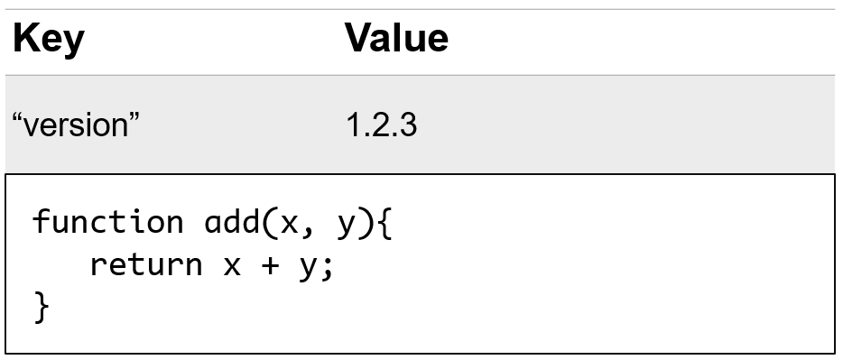
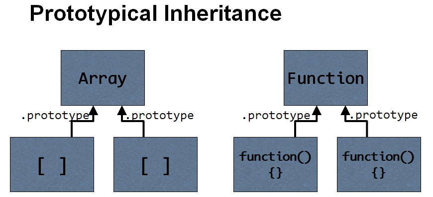
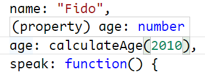
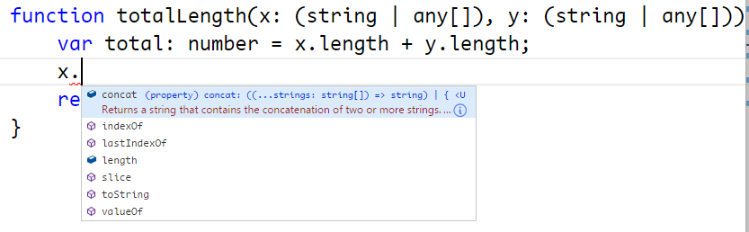
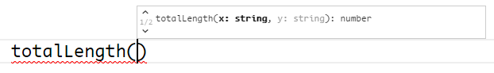

# Type Fundamentals {#type-fundamentals}

## Introducing JavaScript Types

In the introductory chapter I explained that TypeScript brings static typing capabilities to the JavaScript language.  In this chapter I'll show you the syntax that TypeScript uses to apply type information to your code, and even how to define the complex data structures that your application depends on.

Before I get into complex data structures, however, let's just start by calling out all the types that JavaScript offers you right out of the box, since these are at the core of everything we do in JavaScript and will be the building blocks that we will use when defining our own complex types later on.

Though it may sound sparse, the ECMAScript 5 specification only defines six data types.  

* `boolean`
* `number`
* `string`
* `null` / `undefined`
* `object`

The first three are very popular primitive values: `boolean`, `number`, and `string`.  
These types are immutable, meaning once one of these values are defined, it cannot be changed.

Then there are two special types:  `null` and `undefined` -- that's right, JavaScript has two different ways to refer to nothing!
And, finally, there's the type that encompasses all other JavaScript types:  `object`.  

### Objects
You can think of JavaScript objects as simply a dictionary of properties, identified or indexed by string keys.  And, unlike the other data types, object properties may be changed after they're defined - you can even add new properties on the fly! 

| Key       | Value         |
|----------------------------|
| `"name"`  | `"Jess Chadwick"`|
| `"age"`  | `21`|
| `"gender"`  | `"Male"`|
|----------------------------|

The fact that ES5 only defines six data types may surprise you since you've probably used a lot of other types such as `Date`, `Regex`, etc., but those are all just different kinds of objects.  

But, perhaps the most important object types are **functions** and **arrays**.

### Functions
Functions are regular objects in that they are a collection of properties, but the aspect that sets them apart from all other objects is that they contain logic that can be executed.  

Because of this important ability, functions play an incredibly crucial role in most any JavaScript application so we will be dedicating plenty of time throughout this book to working with functions in a strongly-typed manner.

### Arrays

The other special kind of object type is an array.  Arrays are special kinds of objects containing a collection of values, with each value represented by an integer key.  

| Key       | Value                 |
|-----------------------------------|
| `"name"`  | `"Jess Chadwick"`     |
| `0`       | `"Pick up drycleaning"`|
| `1`       | `true`                |
| `2`       | `1.2.3`               |
|-----------------------------------|

### Object Prototype
Both functions and arrays are also enhanced with additional methods that pertain to working with functions and collections, which they receive from their **prototype**.  

If this prototype sounds important, it is.  As an object-oriented language, JavaScript offers the ability to share properties and behavior between different types through inheritance - a kind of inheritance called **prototypical inheritance**.  

Prototypical inheritance simply means that an object is defined that contain the properties and behavior to be shared, and when new instances of that type are created, JavaScript links those properties and behaviors to the new instance.

This approach to creating objects is important - and I will definitely get more into prototypes and prototypical inheritance in later chapters - but not all JavaScript objects must be created from a constructor that has a prototype.  

### Object Literal
There's an even simpler way to define a JavaScript object called **object literals**.  
An object literal is nothing more than a way to define and instantiate an object all at the same time using a very simple and straight-forward syntax.

For example, here is the most basic object literal, representing a completely empty object:

	{  }
	
Notice how the brackets are used to indicate the beginning and end of the object definition.
Then, we can add properties to the object by defining key/value pairs split with a colon in the middle, and those values can be any type, like so:

	{
		name:  "Fido",
		species: "Dog",
		age:  5
	}
	
In this example, I've defined three different properties, and assigned them all values.  
I've also separated all of the values with both a comma and a line break, though whitespace doesn't matter when defining object literals, which means that I could remove all the spaces and line breaks and end up with this:
	
	{name:"Fido",species:"Dog",age:5}
	
Yes, it's true that that this would be exactly the same object...  but it's far less readable, so let's add them back before I get a headache!

	{
		name:  "Fido",
		species: "Dog",
		age:  5
	}

Now that I can see the object clearly again, let's go the next step and give this object some behavior by defining a function.  As I mentioned earlier, functions are just regular values so I can define and assign them in exactly the same way that I assign other values:

	{
		name:  "Fido",
		species: "Dog",
		age:  5,
		speak:  function()  {  console.log('Woof!'); }
	}

Again, whitespace doesn't matter:  I can put the whole function definition on one line, or spread it across multiple lines - it's up to me.

	{
		name:  "Fido",
		species: "Dog",
		age:  5,
		speak:  function()  { 
			console.log('Woof!'); 
		}
	}

Now that I have this object, I can do things with it, like pass it to a function:
	
	function makeTheAnimalSpeak(animal) {
        animal.speak();
        animal.speak = 1;
	}
	
	var animal = {
        name:  "Fido",
        species: "Dog",
        age:  5,
        speak:  function()  { 
            console.log('Woof!'); 
        }
	};
	
	makeTheAnimalSpeak(animal);
	
	
Notice how the function just calls the `speak()` method on the object that it's given.  This is a great example of duck typing in action -- the function doesn't check to see if the object is a certain type, or if the method exists before calling it -- it just calls the method and assumes that the code that passed the object in knew what they were doing.

In addition to being a great example of duck typing in action, it's also a great example of a place where static typing can really help, and I'll build upon this simple example throughout this book to show you how.

In this section, I gave you an overview of the fundamental types that JavaScript provides, and a quick demonstration of how to create, instantiate, and populate your own types on the fly using object literals.  In the next section, I'm going to talk about how TypeScript uses a concept called **type inference** to analyze this code just as it is to start giving you feedback and help you write better code without having to do anything more than what you see here.

{pagebreak}

## Understanding Type Inference

In the previous section, I showed you how to create, instantiate, and populate a new type of object on the fly using the object literal syntax.  In this section, I'm going to talk about how TypeScript's powerful static analysis capabilities can give you significant insights into your code using a concept called **type inference**... all while still using standard JavaScript.

Static analysis means that - regardless of whether you explicitly define types or not - TypeScript looks through your code, doing its best to guess (or "infer") what type any given object could be.  

In other words, even though this is just plain old JavaScript, just using the code that is written TypeScript is able to figure out that the type of the `name` and `species` properties are strings, the `age` property is a number, and the `speak` property is a function.  Heck, it even knows that the `animal` variable is a type that has 4 properties: `name`, `species`, `age`, and `speak`!  It knows all of this because it can inspect the assignment of each of these properties to see what type of value was assigned to them.

Even though I never asked it to, TypeScript will even start to enforce these inferred types, yelling at me if I try to set the `name` property (which is a string) to a number value.

	var animal = {
        name:  "Fido",
        species: "Dog",
        age:  5,
        speak:  function()  { 
            console.log('Woof!'); 
        }
	};
	
	animal.name = 1;

The same thing goes for return types, too.  If I create a function that returns a value with a type that TypeScript can determine through static analysis - such as a string, a number, or even an object literal - TypeScript can use that information wherever that return value is used.

For example, let's say I add a function to calculate the animal's current age by subtracting the year it was born from the current year:

	function calculateAge(birthYear) {
		return Date.now() - birthYear;
	}

When I hover over the method, I can see that TypeScript has figured out that the type of the return value will be a number.  What's more, it's figuring that out regardless of the fact that I didn't specify the type of the `birthYear` parameter!  
TypeScript is smart enough to know that the result of `Date.now()` is a number, and any time you subtract something from a number, you're going to get a number.

Likewise, I can change the assignment of the `age` property to call this function instead: 

~~~
# leanpub-start-delete
    age:  5,
# leanpub-end-delete
# leanpub-start-insert
	age:  calculateAge(2010),
# leanpub-end-insert
~~~

And, when I do, I can hover over the property to see that TypeScript is assigning the number type from the function's return type.

Now think about the effect this would have if this function were called by many other places throughout the code.  Knowing the return type of this code would allow TypeScript to make better inferences about the code that calls this function, which may then trickle into the code that calls those functions, and so on.

Because of this, strategically applying type information to common, low-level functions and API calls is a great way to start getting the most out of TypeScript's type inference in your existing JavaScript codebase without having to write any TypeScript-specific code.

While TypeScript's ability to infer types may be impressive, it does have its limits.  
For example, look at this function which takes in two parameters and adds the value of their length properties. 

	function totalLength(x, y) {
	    var total = x.length + y.length; 
	    return total;
	}
	
Since every object has a length property that is a number value, this function should work with pretty much any inputs and return a number every time.  However, even though we can understand it relatively easily, TypeScript has no idea what to do with it.

Whenever this situation occurs -- whenever TypeScript doesn't have enough information to definitively figure out what the type of a given object is -- it simply gives up and says that it's the most unrestrictive type of all:  the `any` type.

The `any` type is the most dynamic and unrestrictive type available - in other words, the default dynamic type behavior of JavaScript-  and that means that anything goes:  you can call it as a function, set its value to one type, and then go ahead and set that same object to a value of another type.

Working with dynamic types like this can be quite powerful - in fact, it's one of the reasons that so many people love JavaScript.  However, whenever you switch into the `any` mode, you lose any and all help that TypeScript provides by enforcing types in your code, even something as common as the `length` property.  

That means that TypeScript isn't even able to offer us even the most basic static typing protection to warn me if I spell a property name like `length` wrong:

~~~
# leanpub-start-delete
    var total = x.length + y.length;
# leanpub-end-delete
# leanpub-start-insert
    var total = x.length + y.lengt;
# leanpub-end-insert
~~~

Sometimes a truly dynamic object may be what you want, but it's important to keep in mind that TypeScript's type checking exists to help you avoid mistakes in your code so most of the time you're going to want to work with TypeScript to give it the information it needs and avoid the `any` type as much as possible.  Reserving the any type only for cases when you're actually working with a dynamic object will make your life much easier.

In this section, I showed how to leverage TypeScript's type inference to help you write better JavaScript without introducing any TypeScript syntax, but we ended up in a situation where TypeScript didn't have enough information to safely infer the type of an object and needed a little more help.  In the next section, I'll show you how to give TypeScript the information it needs 

{pagebreak}

## Specifying JavaScript Types

In the previous few sections I introduced you to the handful of primitive types that JavaScript offers out of the box and how TypeScript is able to figure out which type a variable is just by inspecting how you use it.  At the end of the last section, I also showed you that TypeScript is only so smart and can't always figure out variable types without a little help.  In this section I'll show you how to clear up the confusion by explicitly defining the type of variables, function parameters, and return values to take most of the guessing out of the way and give TypeScript all the information it needs to figure out the type of every object in your application.

Let's start off where we left in the last section, with this method, complete with the spelling error that I left it with:

	function totalLength(x, y) {
	    var total = x.length + y.lengt;
	    return total;
	}
	
First I'll tackle that misspelling by specifying the type of the `y` parameter.  I'll specify the type by adding a colon after the parameter followed by the name of the type.  For this example, I'll say it's a string:

	function totalLength(x, y: string) {
	    var total = x.length + y.lengt;
	    return total;
	}
	
As soon as I do that, TypeScript finally has enough information to notice that I have a mistake in my property name and let me know by highlighting it as an error.  Now I can fix that and keep applying my type information.

	var total = x.length + y.length;

Since I've already shown you how to define the type of a parameter, I'm going to hold off on giving the `x` parameter a type -- plus for now I want to keep the `x` parameter as an any type so that TypeScript still doesn't know anything about it.  

I want to leave it as the `any` type to show you that if I hover over the `total` variable I see that TypeScript is telling me the `total` variable has the type `any` as well.  In other words, even though TypeScript now knows for a fact that the `y.length` property is a number type, because the `x` parameter is the `any` type, TypeScript has no idea what its properties are and can't validate that the `length` property even exists, let alone what its type is.  So, it just completely gives up and says that the whole equation returns a value of the `any` type.

Here's where I need to step in and give TypeScript enough information that it stops giving up and starts helping me again.
Since I happen to know that the total variable is a number type, I've got two options here:  

1. I can specify type information for the `x` parameter so that TypeScript knows that the `length` property is a number, just like I did with the `y` parameter...  or...
2. I can explictly tell TypeScript that the `total` variable is a number type by applying that same type syntax to the variable declaration itself, like this:

~~~
function totalLength(x, y: string) {
# leanpub-start-delete
    var total = x.length + y.length;
# leanpub-end-delete
# leanpub-start-insert
    var total: number = x.length + y.length;
# leanpub-end-insert
    return total;
}
~~~

In this case, I'm telling TypeScript:  "Don't worry, I know that this equation will return a number, so just go ahead and enforce that from now on.

Something else interesting happens now, too.  If I hover over the function signature, I can see that TypeScript has used its type inference to figure out that the function's return type is indeed a number.  Now, that happens to be true, but what if I wanted to change that?  What if I wanted to explictly say that this function returned, say, a string instead of a number?

Well, that's easy, too:  just apply the same type syntax to the function itself, right after the parentheses holding the function arguments:

~~~
# leanpub-start-delete
function totalLength(x, y: string) {
# leanpub-end-delete
# leanpub-start-insert
function totalLength(x, y: string): string {
# leanpub-end-insert
    var total: number = x.length + y.length;
    return total;
}
~~~
	
Of course, as soon as I do that, TypeScript now highlights the return statement, yelling at me that I'm returning a number instead of string -- and that's a good thing, because it's wrong!  So, let's go ahead and fix that by specifying the return type as a number instead of string, like it's supposed to be:

	function totalLength(x, y: string): number {
	    var total: number = x.length + y.length;
	    return total;
	}

You might be wondering why I am choosing to explicitly declare the function's return type even though TypeScript is smart enough to figure it out.  That's a good question, and the answer comes back to one of the primary reasons for using static types at all: the more explicit you are in your intent, the better the type system can help you find mistakes!  

Yes, this method happens to return a number now, but if I come back later and change the code to return a string instead of a number, I will still have that check in place so that TypeScript can warn me that the code I just wrote doesn't match how I originally said the function should behave.  Maybe I meant to change the type, or maybe I did it on accident - either way, TypeScript has notified me of the mismatch and I can then decide how to resolve it.

And, speaking of being explicit, let's wrap up this example by giving the `x` argument a type, too.  This time, though, I'm going to get a little crazy and say that I expect the `x` argument to be an array of objects.  Since I'm only interested in the length of the array, I don't really care what values are in the array, as long as its an array... in other words, an array of `any`:

	function totalLength(x: any[], y: string): number {
	    var total: number = x.length + y.length;
	    return total;
	}
	
With that in place, I've now explicitly defined all of the types on my function, including its return value, which should help keep me from adding bugs later on as well as help me to consume this method in the rest of my application.

Now, if you're scratching your head right now wondering why I'd make a method like this at all -- a method that takes one array parameter and one string parameter and adds their lengths together -- I don't blame you.  In the next section, I'll show you how to use union types to allow either of the arguments to accept a string or an array.

{pagebreak}

## Union Types

In the previous section, I showed you how to add type information to a function and ended up with the following function that takes two arguments - an array and a string - and adds their lengths together.  I also mentioned that it's kind of weird that the first argument *must* be an array and the second *must* be a string.  In this section, I'm going to show you how to use a TypeScript feature called **union types** to allow each of the arguments to accept either a string or an array.

To specify a union type, you simply wrap the type definition in parenthesis and use the pipe operator (also sometimes known as the OR operator) to list additional types that are acceptable.  

For example, I want the function I've been working on to allow the x and y arguments to accept either a string or an array, and I'll do that with this syntax:

	function totalLength(x: (string | any[]), y: (string | any[])): number {
	    var total: number = x.length + y.length;
	    return total;
	}
	
Since the string type and the array type both have a `length` property, my code continues to be perfectly valid.  In fact, the string type and the array type happen to share a couple of members, and TypeScript gladly offers them as autocomplete options:
	

    
If, however, I attempt to access a member that only belongs to one type or the other TypeScript will yell at me, telling me that I can't access the member because doesn't exist on both types:

	function totalLength(x: (string | any[]), y: (string | any[])): number {
	    var total: number = x.length + y.length;
	    
	    x.slice(0); // Works fine!
	    x.push('abc'); // Error: only exists on arrays
	    x.substr(1); // Error: only exists on strings
	    
	    return total;
	}
	
This is fine for our example, but let's say that I really do want to be able to treat each variable differently depending on which type it is.  In other words, it's nice that I can add up the total of the length property, or even call slice, but what if I want to be able to push a value onto an array if it's an array type or get the substring of a string if it is the string type.  

Luckily, TypeScript is smart enough to handle that too - just use the built-in JavaScript keyword `instanceof` to test the variable's type, like this:

	 if(x instanceof Array) {
        x.push('abc'); // Works, because we know x is an array!
    }
	
After doing that, TypeScript knows that in order to make it into the if block, the object had to be an Array so TypeScript lets you treat it like an array.  This is known as the **type guard** syntax.

Once I exit the if block and am outside of the scope and safety of the type guard, TypeScript can no longer guarantee the variable's type, so I'm back to only being able to access the members that both union types share.

I can also do the same thing with the string type:

	if(typeof x === 'string') {
        x.substr(1) // Works, because we know it's a string!
    } 

Notice how in this case I had to use the `typeof` operator and match it against the type name `string`.  That's because `string` is a primitive type and this syntax is only reserved for the couple of primitive types.  You'll almost always use the `instanceof` operator.

TypeScript's Union Types and Type Guard syntax can be really helpful in creating flexible and forgiving functions and variables that let you take advantage of JavaScript's dynamic nature while not completely giving up the safety of static typing.  It may not be a feature you end up using a lot, but when you come across a situation where you want to be able to accept multiple different types in the same variable, it can be a great fit.

{pagebreak}

## Function Overloads

In the previous section, I showed you how to use union types to give the option for consumers of a function to pass in several different types for a given property, but I ended by complaining that in some cases union types aren't restrictive enough.

In other words, I've got two parameters -  `x` and `y` - and each of them can accept a string or an array.  However - even though this happens to work because they both share a `length` property - it really doesn't make sense to add the length of a string to the length of an array.  What I really want to do is expose two different signatures for this method: one that allows you to pass in two strings, and one that allows you to pass two arrays.

If you've got experience with a statically-typed language like C# or Java, you'd probably implement this using multiple different signatures of the function sharing the same name;  in other words, you'd create an overloaded function that might look something like this:

	function totalLength(x: string, y: string): number {
	}
	
	function totalLength(x: any[], y: any[]): number {
	}

TypeScript also supports the idea of overloaded functions, but not in the same way that these other languages do.  In languages like C# and Java you'd implement two completely different functions and you'd associate them together simply by giving them the same name.  

But, this just simply won't work in JavaScript because if you wrote the example I just did, the second definition of the `totalLength` function would simply overwrite the first definition!

So, in JavaScript we can only have one single implementation of a function:

	function totalLength(x: (string | any[]), y: (string | any[])): number {
	    var total: number = x.length + y.length;
	
	    if(x instanceof Array) {
	        x.push('abc'); // Works, because we know x is an array!
	    }
	
	    if(x instanceof String) {
	        x.substr(1) // Works, because we know it's a string!
	    } 
	
	    return total;
	}
	
The way that TypeScript allows us to define overloaded functions is to simply add the alternate signatures that we want to expose right on top of the actual function implementation, like this:

	function totalLength(x: string, y: string): number
	function totalLength(x: any[], y: any[]): number
	function totalLength(x: (string | any[]), y: (string | any[])): number {
	    var total: number = x.length + y.length;
	
	    if(x instanceof Array) {
	        x.push('abc'); // Works, because we know x is an array!
	    }
	
	    if(x instanceof String) {
	        x.substr(1) // Works, because we know it's a string!
	    } 
	
	    return total;
	}

Notice that I haven't changed the underlying implementation at all - it still accepts either a string or an array for either parameter and its logic still works exactly the same.  The only difference is that when I attempt to consume this function...

	
I only see the two overload signatures that allow me to pass two strings or two arrays, but TypeScript does not show me the option to call the underlying function that takes both a string and an array together.

Function overloads, like all other type information, is the first thing to be ripped out of the source code when TypeScript compiles it to JavaScript.  So, the end result is that when you look at the generated JavaScript you will only see the underlying function and not have any hint that these overloads were ever defined in the TypeScript version.

Because it doesn't actually change the functionality of the function, you can think about function overloads in the exact same way that you think about specifying variable or parameter types -- it's simply metadata for TypeScript to help you write better code.