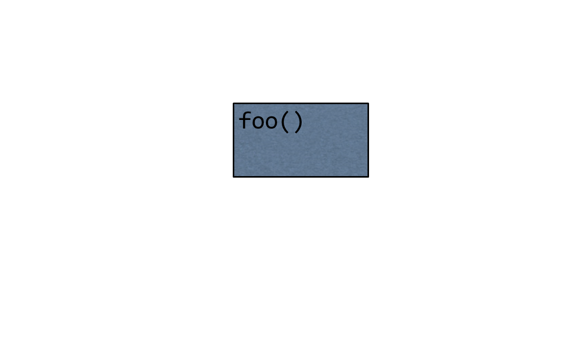
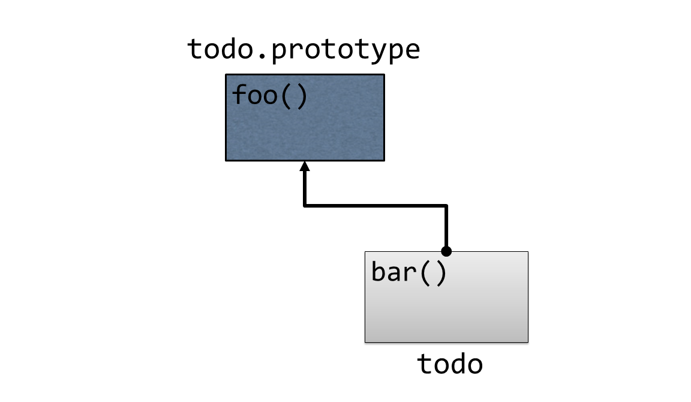
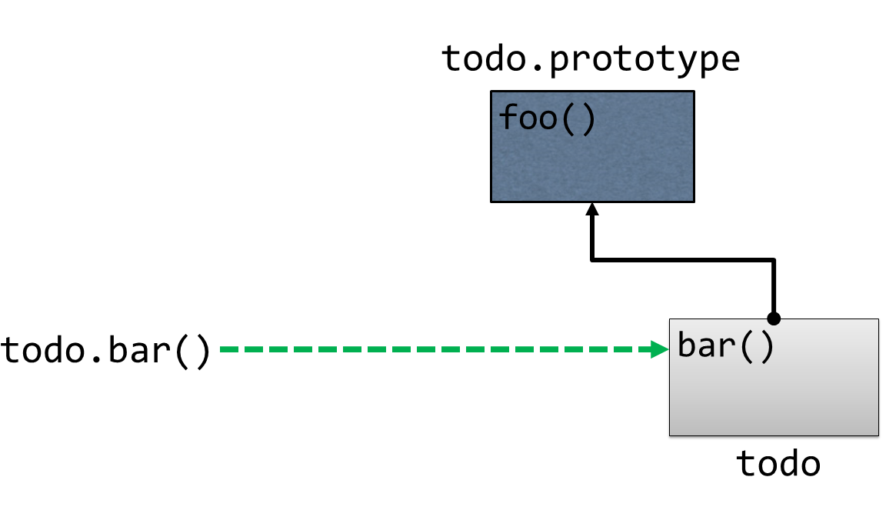
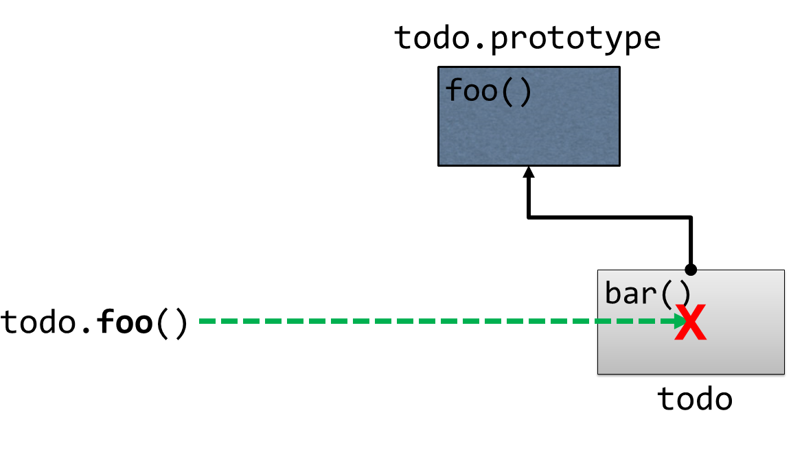
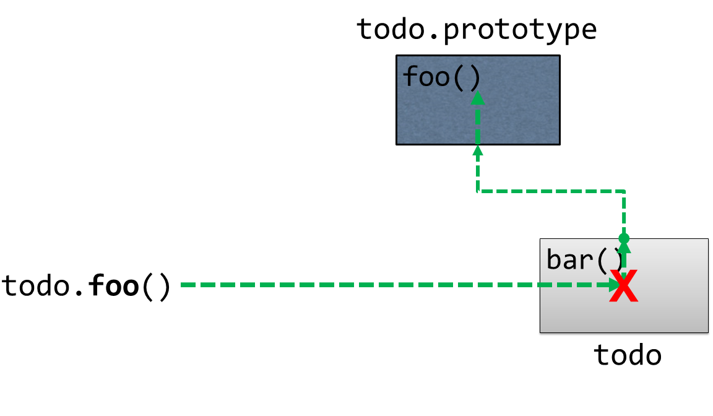
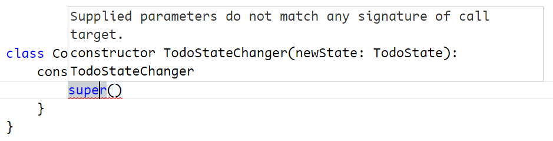
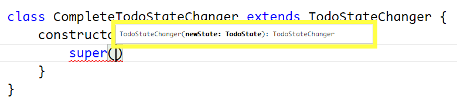

# Classes

## Understanding Prototypical Inheritance

In the previous chapter I mentioned that TypeScript offers 3 ways to define custom types:  interfaces, enums, and classes, then I showed you all about how to use interfaces and enums.  Now it's time to show you how to implement custom types using classes and use those classes to implement all kinds of object-oriented functionality such as inheritance, abstraction, and encapsulation.  Before I get into the syntax of creating a class, however, I want to define what JavaScript a class is - and is not.

First off, I want to be clear that TypeScript doesn't introduce the concept of a class - ECMAScript 2015 does!  However, it's crucial to understand that - even though JavaScript does now have a `class` keyword and syntax, all of this is syntactic sugar and it doesn't change the fact that JavaScript is still based on objects and prototypical inheritance, otherwise known as prototype-based programming.

Prototype-based programming all starts with a special object called the **prototype**.  

If you want to share behavior between object instances, you define that behavior on the prototype object, and then link other object instances to that object.

Keep in mind that in JavaScript, objects are just bags of dynamic properties, which means that accessing a member of an object is not as simple as testing whether or not that member exists.  Instead, whenever you attempt to access any member of an object - regardless of whether it's a method or a value field - JavaScript tries as hard as it can to find the member that you're looking for.

First, JavaScript looks for the member on the object itself, just like you asked it to.  If it finds a member with that name on the object you referenced, then great!  It accesses that member and it's done!  

If, however, JavaScript does not find a matching member on that object, it doesn't give up there.  

Instead, it looks at the object's prototype object to see if the member exists on that object.  If a member of that name exists on the prototype, then JavaScript refers to that member and it's done!  Otherwise, it accesses the prototype's prototype, and the cycle continues... all the way up the chain until it reaches the root of everything:  the Object prototype.

And I mean that quite literally:  `Object.prototype` is actually an object that you can see and interact with.  That means that if you type `Object.prototype` into the console...

	
everything that you see on this object will be available to all other JavaScript objects.

The next question is: where does this special prototype object come from and how (and when) is it assigned to my objects?  The simple answer is that, most of the time, JavaScript does it for you.  The more complex answer is that there are actually quite a few ways that prototype objects get assigned.  

Let's look at a couple of those ways, starting with a simple object literal:

	var todo = { };
	
When JavaScript creates any object - even one as simple as this - it automatically links its prototype object to the Object prototype.

The same is true of the other two "special" types of objects that I mentioned in the last chapter - functions and arrays - only, when JavaScript creates objects with these two types, it links them to the Function.prototype and Array.prototype objects respectively, allowing all functions and arrays to share common behavior such as the .slice method on an Array or the `.bind()` method on a function.

Perhaps the most common way that JavaScript assigns a prototype to an object is with a **constructor**, which is really just a function that is called with the `new` keyword.  When you initialize an object with the `new` keyword, JavaScript does three things:

1. Creates a new object
2. Sets the new object's prototype to the constructor function's prototype
3. Executes the function that you called with the `new` keyword (referring to the new object as `this` within that method)

To see this in action, I'll create a new function that will act as the constructor function:

	function TodoService() {
	    this.todos = [];
	}
	
This simple function just assigns the `todos` property on the `this` object to a new, empty array.  Remember, this `this` object refers to the object that JavaScript just created for us in the first step.

Then, I can define members that I want to be available to all instances of `TodoService` to its prototype, like this:

{linenos=on}
	function TodoService() {
	    this.todos = [];
	}
	
	TodoService.prototype.getAll = function() {
	    return this.todos;
	}
	
Notice how I'm referring to the array of todos through the `this` keyword in this method.  Just as you'd expect, the `this` keyword refers to the instance of the object, so `this.todos` on line 6 will refer to the same `this.todos` on line 2 at runtime.

With this in place, I can create a new instance of the `TodoService`

	Var todoService = new TodoService();
	
And then I can call the methods that are defined on the prototype like they were defined on the instance itself:

	todoService.getAll();
	

And that is a very quick overview of prototypical inheritance in action.  I gave this recap because it's crucial to understand prototypes and prototypical inheritance when dealing with any JavaScript code, but it's especially important to keep this behavior in mind as you use the class syntax that I will show you in the next section to define the behavior in your application.  Just keep in mind that, even though you may be using a new syntax, you're still using JavaScript's prototype-based behavior.
	

## Defining a class

In the last section, I explained how JavaScript's prototypical inheritance works and how you can share behavior across objects by defining behavior on a prototype object.  If all of that seemed a little overwhelming or unwieldy to have to type, I don't really blame you.  That's why ECMAScript 2015 introduced the class syntax that allows you to define this same behavior in a much simpler and more straight-forward way.  What's more, you can use all of the TypeScript features I've shown so far to extend the ECMAScript 2015 class syntax with additional static type information.

At its core, the  ECMAScript 2015 class syntax is pretty simple.  To demonstrate, I'll convert the prototype-based example from the previous section to use the class syntax instead:

	function TodoService() {
	    this.todos = [];
	}
	
	TodoService.prototype.getAll = function() {
	    return this.todos;
	}
	
I'll start by defining the class itself, which is just the class keyword, followed by the class name - in this case, `TodoService` - followed by brackets that contain the class's members:
 
	class TodoService {
	}
	
Then, I can begin adding members to the class.  The syntax you use to define members of a class is almost exactly the same as the syntax you used to define members of an interface.

I'll start with the class's constructor function, which is the function that JavaScript calls to initialize the new object.  In the prototype-based syntax, the constructor function is simply the function that you attach all of the prototype behavior to - in our example, it's the function named `TodoService`. 

In order to define a constructor function using the class syntax, you simply define a method with the name `constructor`, like this:

	class TodoService {
	    constructor() {
	    }
	}
	
Likewise, I can add methods to the class as well, using the same syntax that I used to define them on an interface:  basically just the standard way of defining a JavaScript function, except without the `function` keyword.

For example, I can implement the `getAll` method, like this:

	class TodoService {
	    constructor() {
	    }
	    
	    getAll() {
	    }
	}
	
Now that I've got a class with a constructor and a method in place, let's add the array of todos that I referenced in the prototypical inheritance example.

In that example I defined the property by simply assigning a value to the `this` object - in other words: `this.todos = []`.  Let's try to copy that call into the new constructor and see what happens.

    constructor() {
        this.todos = [];
    }
	
When I try to assign a property on the `this` object in a class constructor, TypeScript will yell at me, saying "Hey! You're trying to assign a value to a property that I don't know about!"  That's a good thing - TypeScript is trying to make me define a property before I access it... but, how do I do that?

Well, there are a couple of ways...

The first and simplest way is to define the property just like I did with on the interface:  by defining the member outside of the constructor like this:

	class TodoService {
	    
	    todos;

Up to this point, everything I've shown you is just ECMAScript 2015 class syntax, but here's where TypeScript comes into play by allowing me to specify type information on this property:

	class TodoService {
	    
	    todos: Todo[];

This syntax tells TypeScript that the `TodoService` has a property named `todos` that can contain an array of `Todo` objects, but it doesn't actually create the property - that only happens in the constructor when I call `this.todos = [];`

However, I can combine these two operations by defining a property and assigning and initializing it with a value all in one expression like this:

	todos: Todo[] = [];
	
This approach is a great way to define an initial variable that's the same every time a new object is created.  But, you may often find that you would like to accept these initial values as parameters to the constructor function as opposed to the hard-coded values I've shown here.

In other words, you'll end up doing this:

    todos: Todo[] = [];
    
    constructor(todos: Todo[]) {
        this.todos = todos;
    }

Since this is a pretty standard practice, TypeScript actually gives you one more bit of syntactic sugar, and that is the ability to define a constructor parameter and a class property all in one expression, simply by putting an access modifier such as `private` in front of it.  

In this example, that means that all five of these lines can be condensed into one expression:

    constructor(private todos: Todo[]) {
    }

Finally, now that I've defined and assigned the `todos` property, I can update the code in the `getAll` method to retrieve them by referencing them as `this.todos`, just like in the prototype-based approach:

	getAll() {
	   return this.todos;
	}

With this in place, take a look at the code that TypeScript generates.  

{title="TodoService.js (generated code)"}
~~~
var TodoService = (function () {
    function TodoService(todos) {
        this.todos = todos;
    }
    TodoService.prototype.getAll = function () {
        return this.todos;
    };
    return TodoService;
})();
~~~
	
Does that look familiar?  That's right, after all of this syntactic sugar is stripped away and compiled down, TypeScript is just creating a prototype-based object underneath it all.  That's why the bulk of the code that you'll write inside of your methods will look pretty much exactly the same as it did when you user using the prototype-based syntax... because it is still prototype-based!

Regardless of that fact, I've found the class syntax to be an effective way to both think about and implement object behavior.  And this syntax becomes even more powerful as you implement the rest of the features in this chapter to build out nice, clean, and maintainable objects.  So, move on to the next sections where I'll show you all of the ways that you can extend and leverage TypeScript classes.

## Applying static properties

There are some situations in which you need to be able to maintain one single value that is used across many components - or many instances of one type of component.  

For example, let's say that every time I create a new Todo item, I want to assign it a unique ID value so that I can retrieve and refer to it later on.  One of the ways I might do that is to keep a single counter in my application and increment it with each new Todo item that is added:  the first Todo is #1, the second is #2, etc.  But, in order to implement that approach, I'd need to ensure that my application has one single variable to keep track of that counter.

In other languages such as C#, Java, or even C/C++, you'd refer to these kinds of variables as **static members**.

For years, the easiest and most acceptable way to implement static members in JavaScript was to simply create a variable in the global namespace, like this:

	var lastId = 0;
	
However, global variables are now generally considered bad practice and to be avoided at all costs.  So, instead of putting the variable in the global scope, I want to be able to nest it inside some other object.

These days, the more generally accepted practice of defining a static variable is to attach it to an object - especially the function that is going to use it the most.  In order example of incrementing a unique ID to apply to new Todo items, that function would be the `TodoService` I created in the previous section.

Prior to the ECMAScript 2015 class syntax, when I'd create a constructor function and then attach behavior to it via its prototype, I'd define that lastId variable directly onto the `TodoService` constructor function itself, like this:

	function TodoService() {
	}
	
	TodoService.lastId = 0;
	
Since there is only ever one instance of the `TodoService` constructor function in our application, there will only ever be one instance of any variables I attach to that function.

In order to access this static variable - even in methods that are part of the `TodoService` - I'd have to do so by referring to the variable through the constructor function, exactly as I'd assigned it in the first place.  

In other words, I'd have to access it this way:

	TodoService.prototype.add = function(todo) {
	    var newId = TodoService.lastId += 0;
	}
	
Likewise, I can use the same approach to define a static method as well:

	TodoService.getNextId = function() {
	    return TodoService.lastId += 0;
	}
	
And, I'd access the static method in the same way, too:

	TodoService.prototype.add = function(todo) {
	        var newId = TodoService.getNextId();
	 }
	
	
Now, that's the way I'd do it in the ES5 syntax, but with the ECMAScript 2015 class syntax, I simply add the property to my class just like I would add a regular property, and then put the keyword `static` in front of it:

	class TodoService {
	    
	    static lastId;
	    
	    constructor() {
	    }

I can even apply type information and assign it an initial value, just like any other class property.

	class TodoService {
	    
	    static lastId: number = 0;
	    
	    constructor() {
	    }

And, staying true to it's ES5-compatible nature, TypeScript diligently compiles this syntax down into the same exact approach that I demonstrated earlier: by attaching a variable directly to the `TodoService` constructor function.

    TodoService.lastId = 0;

Likewise, I can also apply the `static` keyword to methods as well:

    static getNextId() {
        return TodoService.lastId += 0;
    }
	
Because it is all just the same code underneath, it's important to note that I consume the static property exactly as I did when I assigned it to the constructor function.

{title="TodoService.ts",linenos=on}
~~~
class TodoService {
    
    static lastId = 0;
    
    constructor() {
    }

    add(todo: Todo) {
        var newId = TodoService.getNextId();
    }

    getAll() {
    }
    
    static getNextId() {
        return TodoService.lastId += 0;
    }
}
~~~
	
Notice how I'm accessing the static variable `lastId` on line 16 and the `getNextId` static method on line 9.

While static methods can be helpful to centralize small bits of common logic used by many components, static properties - even when they are attached to a class rather than defined in the global namespace - are still something that you should avoid at all costs since they tend to make your code a little more brittle, so they really should be your last resort. However, in scenarios such as this - when you need to guarantee a unique value, for instance - ECMAScript 2015 static members can be a very helpful feature.

## Making properties smarter with accessors

In the previous chapter, I showed you how to use interfaces and object literals to define and instantiate simple objects with properties and even behaviors.  Sometimes, however, you may need a property on an object to do a little bit more than just save a value and give that value back  to you when you ask for it later.

For example, in the last chapter I used an interface to define a Todo object that looked like this:

	interface Todo {
	    name: string;
	    state: TodoState;
	}
	
Now, what if I wanted to enforce a specific workflow for Todo states.  Something like: you can't change the state of a Todo to "Complete" unless its state is currently "Active" or "Deleted".

In order to accomplish this, I'd need something a little smarter than the basic property:  I'd need to use a property with **getter and setter methods**. 

Creating a property with getter and setter methods is pretty much exactly like it sounds.  Take this Todo object literal from the previous chapter:

	var todo = {
	    name: "Pick up drycleaning",
	    state: TodoState.Complete
	}
	
In order to convert the state property with getter and setter methods, I'll start by just introducing the getter method, which I'll implement by simply replacing the `state` property with a method called `state()` that accepts no parameters, and put the `get` keyword in front of that method, like this:

	var todo = {
	    name: "Pick up drycleaning",
	    get state() {}
	}
	
That's the basic syntax, but in order for the getter to work it has to return something, so let's start by just returning the hard-coded value `TodoState.Complete`:

	var todo = {
	    name: "Pick up drycleaning",
	    get state() { 
	        return TodoState.Complete; 
	    }
	}

At this point I want to point out that, even though I've been calling them "getter and setter properties" like they have to go together, this code is actually perfectly legitimate -- you don't need to define a getter AND a setter for a property - you can implement either one or both of them, depending on what you're trying to accomplish.
	
In this scenario, however, the magic I'm trying to accomplish is in the setter method, which I define in the same way that I defined the getter method, except that the setter method must take in a parameter, which is the variable to be assigned... and, of course, it must be preceeded by the "set" keyword rather than the "get" keyword that the getter uses.

For example:

	var todo = {
	    name: "Pick up drycleaning",
	    get state() { 
	        return TodoState.Complete; 
	    },
	    set state(newState) {}
	}
	
That's the basic syntax, and it's actually perfectly legitimate to have a setter that doesn't have any logic, effectively ignoring any values that are assigned to it... however, most of the time that you're defining a getter and setter, the very least you're going to do is assign a value to an internal variable with the setter, and retrieve that value from the getter.

For instance:

	var todo = {
	    name: "Pick up drycleaning",
	    get state() { 
	        return this._state; 
	    },
	    set state(newState) {
	        this._state = newState;
	    }
	}
	
Here I've dynamically created the property `_state` in order to have a variable that both the getter and setter have access to.  Note that there's nothing special about this variable name - neither the underscore, nor the fact that I called it `state` - I could have called it `foo` if I wanted to.  In fact, the same thing goes for the setter parameter, too:  I happened to call it `newState`, but its name can be anything at all.

Once I have this in place, I access the `state` variable exactly as I did before.  In other words, as a consumer I have no idea that it's implemented as a getter/setter property - I only see a regular old property.  

That means I can set the value like this:

	todo.state = TodoState.Complete;

And I can get the value like this:

	todo.state;

Ok, so, this is a fully-working example of the getter/setter syntax in action:  I've got a setter method that saves the value of a variable and a getter that gets that value back.  But so far this really doesn't buy me anything - it's no more useful than just a regular old property.

So, let's revisit the `Todo` scenario I described earlier, in which I want to restrict the ability to set the state of the `Todo` to complete only when it is currently either `Active` or `Deleted`.  In order to implement that, I might expand the setter logic to include something like this:

	var todo = {
	    name: "Pick up drycleaning",
	    get state() { 
	        return this._state; 
	    },
	    set state(newState) {
	
	        if( newState == TodoState.Complete ) {
	           
	            var canBeCompleted =
	                   this._state == TodoState.Active 
	                || this._state == TodoState.Deleted;
	            
	            if(!canBeCompleted) {
	                throw 'Todo must be Active or Deleted in order to be marked as Completed'
	            }
	        }
	
	        this._state = newState;
	    }
	}

With this logic in place, every time the state property is assigned a value, the logic in the setter will execute and validate whether or not the new state can bee assigned:  if the `Todo` is in the `Active` or `Deleted` state, everything is fine and the `_state` property is updated.  If not, an exception is thrown and the `_state` property remains in its current state.

Now that I've shown you how to take advantage of the getter and setter syntax, I have to admit something: you normally wouldn't use this approach on an object literal like I've been showing.  It just doesn't make much sense.  But, I've been defining these getter and setter properties on an object literal for two reasons:

1. Well, because that's what the Todo object has been in the previous examples and I didn't want to change it, and
2. To prove that the getter/setter syntax can be applied to object literals if you really want to.

The reason you generally don't want to apply getter/setter syntax to an object literal is because usually when you have this kind of logic you really want to put it in a class and create new instances of that class.  And, when you do that, the getter/setter syntax starts to look a whole lot more applicable.

To demonstrate, I'll create a new class to house this behavior called `SmartTodo`, and I'll give it the one "normal" property that the `Todo` needs: `name`...

	class SmartTodo {
	    name: string;
	    
	    constructor(name: string) {
	        this.name = name;
	    }
	}
	
Then, I'll copy the same getter/setter logic that I defined in the object literal:

	class SmartTodo {
	    name: string;
	
	    constructor(name: string) {
	        this.name = name;
	    }
	
	   get state() {
	        return this._state;
	    }
	    set state(newState) {
	
	        if( newState == TodoState.Complete ) {
	           
	            var canBeCompleted =
	                   this._state == TodoState.Active 
	                || this._state == TodoState.Deleted;
	            
	            if(!canBeCompleted) {
	                throw 'Todo must be Active or Deleted in order to be marked as Completed'
	            }
	        }
	
	        this._state = newState;
	    }
	}
	
As soon as I do that, TypeScript yells at me for reasons that should be expected at this point in the course:  I'm referring to a property named `this._state`, but that property doesn't actually exist on this class!  Of course, that's easy enough to fix -- just define it:

	class SmartTodo {
	    _state: TodoState;
	
With that, the errors go away, and I can now begin using this class:

	var todo = new SmartTodo("Pick up drycleaning");
	
	todo.state = TodoState.New;
	
	todo.state = TodoState.Complete // BOOM!

I have to admit that I don't use getters and setters much, since my personal preference is to stick with mostly simple objects and put this kind of logic into a service (such as the `TodoService` that I defined earlier).  However, there are plenty of folks who prefer to have this kind of logic embedded directly in their class, as well as plenty of scenarios where this is a perfectly understandable approach to take.  And, when you find yourself in need of properties that are more intelligent than just the basic "assign and retrieve" logic that regular properties gives you, the getter/setter method syntax is a great choice.
	

## Inheriting behavior from a base class

In the last section I mentioned that I don't use getter/setter properties much because I prefer to have my logic in a separate class or service.  That's because many times logic that may seem simple on the surface is not so simple when you start implementing it, and the scenario I gave in the previous section about only being able to change the Todo's state when a certain condition is met is the perfect example.

It's the perfect example because I only mentioned the logic that gets enforced when attempting to change the `Todo` to a `Complete` state... but, wouldn't it make sense that if there were logic for the `Complete` state that there'd probably be logic for the other state changes as well?  In these cases, I might want to implement a design pattern called a "state machine" to represent the logic for each of these state changes as their own separate classes.  

Now, I'm not going to explain the details of the "state machine" design pattern here - that's a different book entirely.  But, what I will say is that most of my state change classes are going to look a lot like this `TodoStateChanger` class:

	class TodoStateChanger {
	    
	    constructor(private newState: TodoState) {
	    }
	    
	    canChangeState(todo: Todo): boolean {
	        return !!todo;
	    }
	    
	    changeState(todo: Todo): Todo {
	        if(this.canChangeState(todo)) {
	            todo.state = this.newState;
	        }
	        
	        return todo;
	    }
	    
	}
	
The `TodoStateChanger` class accepts the desired end state as a constructor parameter on line 3, as well as two methods:  `canChangeState` and `changeState` that provide the basic workflow for changing a state.  The `canChangeState` contains basic logic to validate whether or not the `Todo` may be changed to the new desired state.  Likewise, the `changeState` method first calls the `canChangeState` method to make sure it can proceed, and if it is safe, it updates the state on the todo.

In a class-based language like C# or Java, I would use the `TodoStateChanger` class as my base class - creating new classes that derived from it so they could share most of its logic, but also have the ability to override behavior as they see fit.  

Lucky for us, not only does the ECMAScript 2015 syntax introduces the `class` keyword, it also introduces the ability for classes to inherit or "extend" from one another.  So, let's use that syntax to create a version of the `TodoStateChanger` that implements the `Complete` state change that I previously implemented in the getter/setter example.

The first thing to do is to create the new class that is going to extend from the `TodoStateChanger` class.  Since I'm using it to execute the `Complete` state change, I'll call it `CompleteTodoStateChanger` and start by defining it as a regular old class:

	class CompleteTodoStateChanger {
	}
	
Then, inheriting from the `TodoStateChanger` class is as simple as adding the keyword `extends` after the class name, followed by the name of the class that I'd like to extend.  In order case, this class is called `TodoStateChanger`.

	class CompleteTodoStateChanger extends TodoStateChanger {
	}
	
Technically speaking, that's all you have to do to inherit from a class - now we have a brand new class named `CompleteTodoStateChanger` that contains all of the behavior defined on the `TodoStateChanger` base class.  But, usually the reason for inheriting from a base class is to extend and/or override its behavior, which is exactly what we want to do here.

I'll start with the constructor function.  In some other statically-typed languages like C#, whenever you derive from a class that has a constructor with a parameter, you must explicitly define your own constructor in the derived class.  In other words, if we were trying to implement this same example in C#, I'd have to give `CompleteTodoStateChanger` a constructor.

Luckily, that's actually not true in JavaScript.  If you choose to derive from a class that has a constructor and then choose to not create a constructor of your own, you simply inherit the constructor from the base class.

In other words, this would be perfectly valid given the code we're looking at right now:

	var changer = new CompleteTodoStateChanger(TodoState.Complete);
	
That's great for a lot of scenarios, but not for this scenario.  In this scenario it doesn't make sense to set the new todo state with anything but `Complete`, so I'll give the `CompleteTodoStateChanger` its own constructor that does not allow the ability to pass in a todo state:

    constructor() {
    }
	
However, there are two problems with this implementation:

1. You don't have to declare a constructor on a derived class, but every time you do, you have to call the constructor on the base class, and 
2. In this particular case, we want to call the constructor on the base class anyway, to pass in the `Complete` `TodoState`

If I hover over the constructor function to see the error TypeScript is giving, I see that it's actually telling us exactly what I just said, but also a tip:

It's saying that the way to call the constructor on the base class is the `super` function.  So, I'll go ahead and add a call to the `super` function like it says.

Notice how TypeScript gives me full IntelliSense on the `super()` function because it knows that I'm attempting to call the constructor on the `TodoStateChanger` base class.
	
	constructor() {
        super(TodoState.Complete);
    }

Ok, so now that I've called the constructor on the base class and told it that I always want to change the state to `Complete`, let's override the behavior of the base class to enforce the fact that `Todo`'s must be in the `Active` or `Deleted` state in order to be eligible to change state to `Complete`.  In other words, I want to override the logic in the `canChangeState` method on the `TodoStateChanger` base class, and I do that by simply creating a method with the same signature.

	canChangeState(todo: Todo): boolean {
	}
	
Notice how I don't have to use any special keywords like `override` or `new` tell TypeScript that I'm overriding the method like I would have to do with C# or other languages - I just go ahead and write the new method.

Now that I have this method in place, let me start by just reproducing the base class behavior -- in other words, I don't want to override all of the logic in the base method, I just want to extend it a little bit.  I can accomplish this by using the `super` keyword again, only this time `super` is the base class object as opposed to the base class constructor, so I can use it like this:

	canChangeState(todo: Todo): boolean {
        return super.canChangeState(todo);
	}
	
The `super` object is a reference that allows me to continue to access methods defined in the base class even though I'm overriding them.

With all this in place, I can go ahead and add the logic that's specific to the `Complete` state transition, specifically making sure that the `Todo` is either `Active` or `Deleted`:

	canChangeState(todo: Todo): boolean {
        return super.canChangeState(todo) && (
                todo.state == TodoState.Active
            || todo.state == TodoState.Deleted
        );
    }

And that is how you inherit from a base class in TypeScript!  Actually, once again, everything in this example other than the static type information is really just ECMAScript 2015 syntax - even the `extends` keyword.  However, one of the things that JavaScript and ECMAScript 2015 does not support is the ability to define and inherit from abstract base classes -- or base classes that are only defined in order to act as base classes and never actually meant to be instantiated by themselves.  Luckily, TypeScript does support abstract classes, and if you check out the next section, I'll show you how to implement them!

## Implementing an abstract class {#abstract-class}

In the previous section, I showed you how to use the ECMAScript 2015 class syntax to create an inherit from a base class in order to share behavior between classes.  And, I left off in that section by pointing out that even though ECMAScript 2015 doesn't support the idea of abstract base classes, TypeScript does!  In this section, I'll show you how to use TypeScript to implement the power concept of abstract base classes in JavaScript.

Let's do a quick recap:  in the last section, I defined two classes:  `TodoStateChanger`, and `CompleteTodoStateChanger`, which derived from `TodoStateChanger`.  Since both of these were defined as classes, that means that I could create an instance of `TodoStateChanger` directly if I wanted to -- there's nothing stopping me from doing that right now.  However, let's say that my intent was that this class was only ever intended to serve as a base class and never instantiated directly.

Luckily, TypeScript offers the `abstract` keyword to help me express that intent.  By simply placing the `abstract` keyword in front of the class definition like this...

	abstract class TodoStateChanger {

 I can still derive from the class, but TypeScript will consider it an error any time I try to instantiate that class anywhere in my code.

	new TodoStateChanger();
	
What's more, I can express my intent even more by describing any member of the class as abstract simply by applying the `abstract` keyword in front of it as well.

For example, let's say that while I do want the `TodoStateChanger` to define the shared behavior in the `changeState` method, I want to force every derived class to implement their own `canChangeState` method from scratch, and not even implement the basic logic that I currently have.  In order to accomplish that, I simply add the `abstract` keyword to the beginning of the method:

	abstract canChangeState(todo: Todo): boolean {
	
When I do that, of course, the implementation is no longer needed, so I can simply remove it:

	abstract canChangeState(todo: Todo): boolean;
	
Now TypeScript will enforce my intent that every derived class must implement its own `canChangeState` method.  Of course, the derived class I've already created - `CompleteTodoStateChanger` already does implement this method, so we're good there... but, the current `canChangeState` implementation is referencing the base implementation... which doesn't exist anymore!  

Accordingly, TypeScript is yelling at us for making a call to a method that doesn't exist, and we can fix this by simply removing the reference:

    canChangeState(todo: Todo): boolean {
        return !!todo && (
                todo.state == TodoState.Active
            || todo.state == TodoState.Deleted
        );
    }
	
Once I do so, everything is fine again and I have now enforced the fact that my abstract base class may only be used as a base class.  Well... throughout my TypeScript code at least.  Since this is all getting compiled down to JavaScript and sent to the browser, there's nothing stopping some rouge JavaScript code from creating a new instance of the class, but like everything TypeScript is designed to guard me against, there's ultimately nothing I can really do about that.  All I can do is focus on the protection that it gives at development time, and in that regard abstract base classes are an excellent tool.

## Controlling visibility with access modifiers {#access-modifiers}

A few sections ago, I showed you how to apply the `private` keyword to a constructor parameter to automatically assign or "upgrade" that parameter to a property on the class, as I show here:

    constructor(private todos: Todo[]) {
    }

But, the `private` keyword isn't just a way to create properties - if you have ever used a class-based language such as Java or C# then you might know that the `private` keyword is an access modifier, used to hide members of a class from being accessed outside of that class.

And, just like those other languages, you can apply access modifiers to any member of a TypeScript class.  

You can apply it to constructor parameters as a shortcut to automatically turn it in to a member, like I've already shown...

You can apply it to methods:

	private getAll() {
	
And, you can apply it to properties (even static ones!):

	private static lastId = 0;
	
You can also apply them to getters and setters:

	private get state() {
	private set state(newState)
	
However, keep in mind that both the getter and setter must have the same access modifier applied.  In other words, TypeScript won't let you make the setter private and the getter public (which, unfortunately, is exactly what I often want to do!).

Now, I've been applying the `private` modifier in all of my examples so far, but TypeScript actually offers three access modifiers for you to describe how much you want to protect the members of your classes:  `private`, `protected`, and `public`.

The `private` modifier is the most restrictive modifier of the three.  Placing the `private` modifier on a member means that only methods defined directly on the same class definition may access that member.  TypeScript will complain if any other type - including types that inherit or extend from this class - attempt to access the member.

Next, there's the `protected` modifier, which is similar to the `private` modifier in that only methods defined on the same class may access the member, but expands this definition to any classes that inherit or extend from this class.   In other words, it only applies to the base class examples that I showed in the previous two sections.  And, actually, it would have been really useful for the scenario that I have been describing because right now the constructor on the `TodoStateChanger` base class sets the `newState` property, but since it's private none of the derived classes are able to access it!

	abstract class TodoStateChanger {
	    
	    constructor(private newState: TodoState) {
	    }
	
However, if I update this to `protected`... 

	abstract class TodoStateChanger {
	    
	    constructor(protected newState: TodoState) {
	    }

the auto-assigned `newState` property will be accessible to all derived classes, which is exactly what I'd expect to happen.

Finally, there's the `public` modifier, which is the least restrictive of all.  A member with public access may be accessed from any other type.  In other words, the public modifier just describes the default JavaScript behavior, which also means that it's the default access modifier so you probably won't see it much.  

The one case you might see the public modifier more often is actually the same scenario that began this whole conversation: applying it to a constructor parameter to automatically create a property from that parameter.  

For example, in the getter/setter section I created a new class named `SmartTodo` that looked like this:

	class SmartTodo {
	    name: string;
	
	    constructor(name: string) {
	        this.name = name;
	    }
	}
	
You may have wondered at that time why I manually assigned the `name` parameter in the constructor to the `name` property on the `SmartTodo` class and didn't use the private constructor parameter feature to define and assign the property all at once.  Well, I would have, except that at the time I'd only shown you how to use the `private` keyword to accomplish that, and if I'd have used the `private` keyword then the automatically-created `name` property would not have been accessible outside of the class!  But now that I've introduced the concept of access modifiers, I can revise this example to use any of the three modifiers - `private`, `protected`, or `public` - to automatically create a property with the same name and level of access.  

In other words, I can rewrite the `SmartTodo` constructor like this:

	class SmartTodo {
	    constructor(public name: string) {
	    }

Now that I've explained what the three modifiers mean and how to use them, I have to point out that there's a problem with all of this, and that is that JavaScript doesn't actually support private members.  Remember, JavaScript objects are just bags of dynamic properties, and once you add a property to the bag, that property is accessible to everyone who has access to that object, and that's all there is to it.

TypeScript is a superset of JavaScript which means that it doesn't change how JavaScript works, so how can TypeScript support private when JavaScript does not?  Well, the short answer is, it doesn't.  Much like interfaces and specifying a type at the end of a variable or method doesn't change how the JavaScript gets generated, the two access modifiers that TypeScript supports - private and protected - are strictly for your protection during development and have absolutely no effect at runtime in the browser.

But, that doesn't mean they're not worth using.  Keep in mind that one of the most important reasons for static typing is to express the intent of your code.  Since JavaScript has never supported the idea of private members, developers have come up with their own ways to express their intent for a property to only be used by the component itself and not by anyone else.  

Perhaps the most widely-used convention is to put an underscore in front of these variables, like this:

	private static _lastId = 0;
	
Then, if you find yourself calling a member on another class whose name starts with an underscore, then you're probably doing something wrong.  

And, hey, if you like that convention, feel free to keep on using it!  The only thing that TypeScript changes in this equation is that it won't even list private members in its autocomplete options.  And, will consider it an error if you attempt to access another object's private members.  Other than that, if you really, really want to access another object's private members, go ahead and write the code to do so - TypeScript won't stand in your way.  However, much like the rest of the static typing capabilities that TypeScript provides, it's a great idea to use access modifiers to express your intent when you don't want other components interacting directly with certain members of a type.  Even if TypeScript can't enforce this behavior at runtime, I've found that enforcing it during development is good enough for all but the most exceptional scenarios.

## Implementing interfaces {#implementing-interfaces}
 
In the last chapter I showed you how to define interfaces and use them to make sure that the objects you reference have the members that you expect them to. But, the primary reason that interfaces exist in a statically-typed language is to attach them to classes.  And, now that I've shown you how to create classes, it's time to see just how to apply interfaces to them to make sure that they behave like we expect them to.

Before I show you how to apply an interface to a class, I just want to point out something that I think is pretty great:  because TypeScript understands and implements JavaScript's native duck-typing behavior, you don't actually have to do anything in order to make use of an interface.  By simply applying the interface to the variables and return values in which you expect that interface to be present, TypeScript will automatically inspect every object that you attempt to assign to that variable or attempt to return as the return value.  When the object's structure matches the interface you've defined, then it really doesn't matter what type the object is - everything is fine!  However, if the object's structure does not match the interface - it is missing properties or methods that the interface expects, or the types of the properties don't match - only then will TypeScript yell at you that you've attempted to use an object that doesn't match.

All that said, keep in mind the overwhelming theme of this book:  even though you don't have to apply static type information in order for TypeScript to work, the more explicit you are, the better!  In other words, even though TypeScript can figure out that that a class satisfies the needs of an interface, if you intend for that class to implement that interface then you should just go ahead and say it!

Throughout this book, I've created several interfaces and classes; in particular, the `ITodoService` interface and the `TodoService` class.  As you may have guessed by their names, I intend for the `TodoService` to implement the `ITodoService` interface, but at this point the two are not explicitly connected...  so let's go ahead and do that now.  Luckily, that's pretty easy to do - just use the `implements` keyword after the class name, and then the interface that the class must implement:

	class TodoService implements ITodoService {
	
As soon as I do this, TypeScript starts to enforce the interface and gives me an error saying that the `TodoService` does not implement the `ITodoService` interface.  This is because the `ITodoService` interface defines 4 methods - `add`, `delete`, `getAll`, and `getById` - but the `TodoService` class that I showed earlier only implements the `add` and `getAll()` methods.  This is easy enough to fix by just implementing those other missing methods.  

First, I have to add an `id` property to the `Todo` interface so that I can reference `Todo` items by their ID.  That part's easy.

	interface Todo {
	    id: number;
	    name: string;
	    state?: TodoState;
	}

Then, I'll update the `add` method to set that ID property using the `nextId` getter method that I introduced in the getter/setter section.  

    add(todo: Todo) {
        todo.id = this.nextId;
        this.todos.push(todo);
        return todo;
    }

After it gives the `Todo` a unique ID, it adds it to the list of `Todo`s and then returns the `Todo` as the return value.

Next there's the `getAll()` method.: 

    getAll(): Todo[] {
        return JSON.parse(JSON.stringify(this.todos));
    }
    
In previous examples I just let this method return the array of todos directly, but this is actually a bad practice since consumers of this method could choose to manipulate the Todo items themselves and I want to control any changes that happen to them in this class.  So, instead I'll make a copy of the `Todo` items by serializing them to JSON and then parsing them back out again. I know that this seems like it might be expensive, but it's actually a pretty performant way to clone objects!

Then there's the `getById` method, which takes a number indicating the ID of the `Todo` item to find in the list of `Todo`s.  

    getById(todoId: number): Todo {
        var filtered = this.todos.filter(x => x.id == todoId);

        if(filtered.length) {
            return filtered[0];
        }
        
        return null;
    }

In this method l use JavaScript's built-in Array method `filter` to filter the list down to only the `Todo` objects whose ID property matches the `todoId` value that was passed in.  Notice how I'm passing an arrow function to the `filter` method rather than typing out a full-fledged function the long way as I would have had to do in the past. If the filter method call finds at least one item, I return the first item.  Otherwise, I'll return null.

Finally, there's the `delete` method, which accepts a number indicating the ID of the `Todo` item to delete.   

    delete(todoId: number): void {
        var toDelete = this.getById(todoId);
        
        var toDeleteIndex = this.todos.indexOf(toDelete);
        this.todos.splice(toDeleteIndex, 1);
    }

In this method I start by calling the `getById` method to find the actual `Todo` object, then I use the JavaScript Array method `indexOf` to figure out where the object is in the array. Finally, I pass this index to the JavaScript Array method `splice` to remove the `Todo` item from the array.

And that's it!  Now that I've implemented those methods, TypeScript is happy that I've satisfied all of the members of the `ITodoService` interface and stops giving me an error.  Now that I have this interface in place, if I ever change any of these methods so that it doesn't accept the right parameters or returns the wrong type, TypeScript will be sure to let me know.

Also, if you're wondering:  yes, it's possible for a class to implement multiple interfaces at once.  When you want to specify multiple interfaces, you can add them all after the `implements` keyword, separating each one with a comma.

For example, if I have an interface named `IIdGenerator` that describes a type that has a `nextId` property, like this...

	interface IIdGenerator {
	    nextId: number;
	}

I can add this to my list of interfaces on the `TodoService` class like this:

	class TodoService implements ITodoService, IIdGenerator {
	
Then, of course, I have to implement this interface, but since the `TodoService` already has a `nextId` property it already implements the interface so there is nothing to be done and TypeScript is happy.

And that wraps up the chapter on classes!  At this point in the book, I've shown you the majority of the features and syntax that you're likely to consistently leverage while using TypeScript.  The remainder of this book is going to dive deeper into some of the more advanced features that TypeScript provides, but I think you'll actually be quite surprised with how much just these few features can bring meaning and structure to your application code so it's important that you understand everything that I've described up to this point if you're going to start working with TypeScript on a daily basis.  That's not to say that the advanced features I'm going to show you in the rest of the book are unnecessary or irrelevant -- quite the contrary!  Consider these features to be the icing on the cake - they may not be required, but including them makes everything so much better!