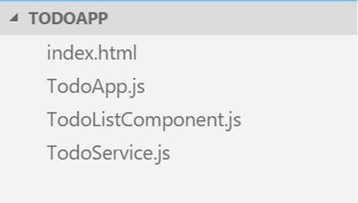
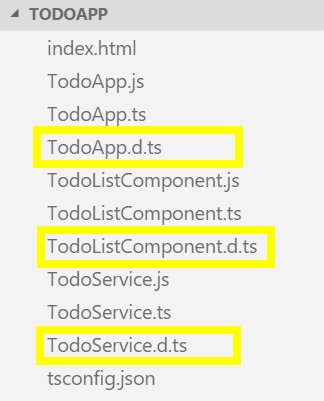
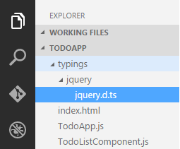
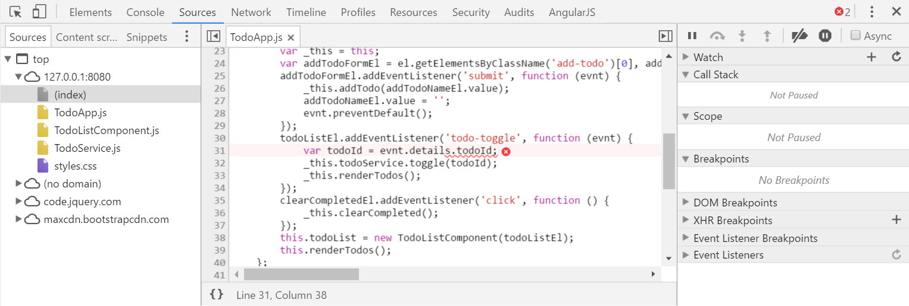
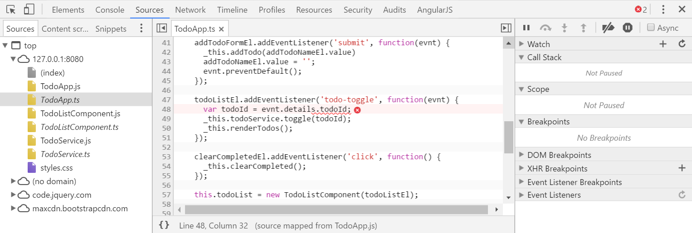

# Real-World Application Development

So far in this book I've shown you a variety of features that TypeScript offers which allow you to introduce powerful static typing capabilities to JavaScript as well as write ECMAScript 2015 code that compiles into code that runs in pretty much any modern browser.  
Even though I haven't shown you every nuance that TypeScript has to offer, I've shown you the 95% of it that you'll use in your day-to-day development.  

But, at this point I'd like to shift the focus from the syntax that TypeScript provides and move toward the mindset that you will need when using TypeScript to create a full-blown JavaScript application - regardless of whether it's converting an existing application or starting a new one from scratch.

Throughout several chapters in the book, I've referred to the fact that I am going to build a sample Todo application to demonstrate how to bring all of TypeScript's features together into a real, working application, and up to this point I've only been showing bits and pieces.  
Well, in this chapter, I'm finally going to show you that complete, working application... except I'm going to start with the application written in ECMAScript 5 syntax and then apply each of the TypeScript features I've shown you in this book in order to convert it into the TypeScript version of the same application.

{width="40%", float="left"}


So, let's walk through this sample application.  We'll start with the `index.html` page of the Todo application.  

<<[TodoService.js](code/RealWorld/index.html)

It's really nothing fancy - just some standard HTML and CSS (using the Bootstrap CSS library that I introduced in the beginning of the book), and a couple of script tags with references to ECMAScript 5 JavaScript files.  

For example, here's the ECMAScript 5 version of the `TodoService` that we've been looking at during this whole book - a great example of building a "class" using the prototype object before ECMASCript 2015 introduced the concept of classes.

<<[TodoService.js](code/RealWorld/TodoService.js)
    	
Next, I've got the `TodoListComponent` class - a class that takes an HTML element and a list of `Todo` objects and uses the jQuery library to render them as HTML.  

{ linenos=true }
<<[TodoListComponent.js](code/RealWorld/TodoListComponent.js)

This class also triggers a custom DOM event called `todo-toggle` on line 44 whenever the user clicks on the `Todo` item.  
In other words, this class is simply a UI component that handles the rendering of `Todo` items and lets other components know about the user's actions by raising a DOM event.

If you've used jQuery before, you probably would have implemented this differently and created a jQuery plugin.  And, quite honestly, I probably would have, too.  But, I wrote it this way so that this class is the only class in the application that uses jQuery, which will be important when I convert everything to the external module approach.

And, finally, the `TodoApp` class, which orchestrates the DOM, the `TodoService` and the `TodoListComponent` together to create a working application.

<<[TodoApp.js](code/RealWorld/TodoApp.js)
	
Now that you've got the lay of the land, follow me through the next few sections as I apply all of the TypeScript features I've shown in this book to bring this application from ECMAScript 5 to TypeScript.  Because I've already shown you all of these features, I'll be moving through the changes pretty quickly, but I think that watching a "classic" JavaScript application evolve into a TypeScript application is a very helpful way to understand the true power of TypeScript...  and I've still got a couple of cool things that I haven't shown you yet.  So, head on to the next section where I show you how to convert an existing JavaScript file into a TypeScript file.


## Converting existing JavaScript code to TypeScript

Perhaps my favorite aspect of TypeScript is that it is a superset of JavaScript which means that "migrating" existing JavaScript applications to TypeScript is pretty much as simple as adding a tsconfig.json file, renaming files from .js to .ts, then updating them to use the new ECMAScript 2015 syntax.  And, in this section, that's exactly what I'm going to do to the sample Todo application I just walked you through.

The first step in creating or converting any TypeScript application is to define the `tsconfig.json` file, and luckily this really is as simple as I showed in the earlier sections:

{ title="tsconfig.json" }
~~~	
{ 
    "compilerOptions": {  
        "target" : "es5" 
    } 
}
~~~
	
Next, I'll jump to the command line and start up the TypeScript compiler in watch mode and leave it running while I make the rest of my changes:

	tsc -w

Then I can start renaming and upgrading my JavaScript files.

Let's start the `TodoService.js` file.  
I've chosen this file because it is at the heart of my application -- it's the thing keeping track of all of the Todo items.  That means, that if I convert the `TodoService` class first then when other classes interact with it, TypeScript will be able to use type inference to help push static typing throughout my application, even if I forget to add the type information in the consuming components.

To convert it to TypeScript, start by renaming the file from `TodoService.js` to `TodoService.ts`.  

Once I've done that, I'll convert the prototype-based approach into a class:

<<[TodoService.ts](code/RealWorld/TodoService-class.ts)
	
Notice that I'm implementing the `lastId` counter as a static variable because I want to keep it out of the global scope for now.  When I switch to the external module approach in a little while, I'll come back and move these into the module scope, exactly like I described in the external module chapter.

Next, I'll introduce some interfaces to define a few custom types. 
For now, I'll just define them right here in the file, and then I'll move them when I'm done.

{title="TodoService.ts",linenos=on}
~~~
interface Todo {
    id: number;
    name: string;
    state: TodoState;
}

enum TodoState {
    Active = 1,
    Complete = 2
}
~~~

Hey, those types look familiar, don't they?

And, now that I have those custom types, I'll apply them to the variables, parameters, and return values throughout my class.

{starting-line-number=32}
<<[TodoService.ts](code/RealWorld/TodoService-with-types.ts)

I'll even replace the magic number that I'm using to indicate the `TodoState` with the custom `TodoState` enum that I just defined.

{title="TodoService.ts", linenos=on, starting-line-number=82}
~~~
switch(todo.state) {
# leanpub-start-delete
  case 1:
    todo.state = 2;
# leanpub-end-delete
# leanpub-start-insert
  case TodoState.Active:
    todo.state = TodoState.Complete;
# leanpub-end-insert
    break;
        
# leanpub-start-delete
  case 2:
    todo.state = 1;
# leanpub-end-delete
# leanpub-start-insert
  case TodoState.Complete:
    todo.state = TodoState.Active;
# leanpub-end-insert
    break;
}
~~~

Maybe I'll add a few overloads to the add method...

{title="TodoService.ts", linenos=on, starting-line-number=35}
~~~
# leanpub-start-insert
add(todo: Todo): Todo
add(todo: string): Todo
# leanpub-end-insert
add(input): Todo {
~~~

Then, I'll go back and clean up those anonymous functions by turning them into arrow functions... which also lets me get rid of those annoying temporary "_this" variables.

{title="TodoService.ts", linenos=on, starting-line-number=27}
~~~
  constructor(todos: string[]) {
# leanpub-start-delete
    var _this = this;
# leanpub-end-delete
        
    if(todos) {
# leanpub-start-delete
        todos.forEach(function(todo) { _this.add(todo) });
# leanpub-end-delete
# leanpub-start-insert
        todos.forEach( todo => this.add(todo) );
# leanpub-end-insert
      }
  }
~~~

{title="TodoService.ts", linenos=on, starting-line-number=60}
~~~
    this.todos = this.todos.filter(
# leanpub-start-delete
        function(x) { x.state == 1; }
# leanpub-end-delete
# leanpub-start-insert
        x => x.state == 1
# leanpub-end-insert
    );
~~~

{title="TodoService.ts", linenos=on, starting-line-number=93}
~~~
private _find(todoId) {
    var filtered = this.todos.filter(
# leanpub-start-delete
        function(x) { x.id == todoId; }
# leanpub-end-delete
# leanpub-start-insert
        x => x.id == todoId
# leanpub-end-insert
    );
~~~

And, while I'm at it, I'll turn the clone method into a generic function:

{title="TodoService.ts", linenos=on, starting-line-number=20}
~~~
# leanpub-start-delete
private static clone(src) {
# leanpub-end-delete
# leanpub-start-insert
private static clone<T>(src: T): T {
# leanpub-end-insert
    var clone = JSON.stringify(src);
    return JSON.parse(clone);
};
~~~

And with those changes in place, all of the TypeScript errors have gone away which means I've successfully converted this JavaScript file into a TypeScript file.

Now let's head on to the `TodoApp` and do the same thing, taking advantage of the fact that I've already converted the `TodoService` class.

I'll start by renaming the file from `TodoApp.js` to `TodoApp.ts`.

    mv TodoApp.js TodoApp.ts

Then, convert it to a class...

{linenos=on}
<<[TodoApp.ts](code/RealWorld/TodoApp.ts)

Nothing special here...  Except that, when I define properties on my classes, I like to specify their types with interfaces, rather than depend on implementations directly.  So, let's hop back to the `TodoService`, create and implement the `ITodoService` interface for it...

{title="TodoService.ts", linenos=on, starting-line-number=12}
~~~
interface ITodoService {
    add(todo: Todo): Todo;
    add(todo: string): Todo;
    clearCompleted(): void;
    getAll(): Todo[];
    getById(todoId: number): Todo;
    toggle(todoId: number): void;
}

# leanpub-start-delete
class TodoService {
# leanpub-end-delete
# leanpub-start-insert
class TodoService implements ITodoService {
# leanpub-end-insert
~~~
	
Then jump back and use the `ITodoService` interface for the property type as opposed to the `TodoService` class itself.

{title="TodoApp.ts", linenos=on, starting-line-number=4}
~~~
    private todoService: ITodoService;
~~~

After that the only error I have left is that TypeScript doesn't know what the `TodoListComponent` class is, so let's fix that by converting `TodoListComponent.js` into TypeScript, too.

	mv TodoListComponent.js TodoListComponent.ts
    
{linenos=on}
<<[TodoListComponent.ts](code/RealWorld/TodoListComponent.ts)

Now that I've converted the `TodoListComponent`, everything works great and there are only two TypeScript errors left, and they are both about the JQuery APIs that I'm referencing:  

    TodoListComponent.ts(3,16): error TS2304: Cannot find name 'JQueryStatic'.
    TodoListComponent.ts(6,16): error TS2304: Cannot find name '$'.
    TodoListComponent.ts(29,12): error TS2304: Cannot find name '$'.

Regardless, TypeScript generates the JavaScript code for me anyway, which means that I can now run my fully converted TypeScript application.

	lite-server
	
That's nice that TypeScript compiles my application for me even though I have these two errors, but wouldn't it be nicer if we could actually get rid of those errors, too, by telling TypeScript about the jQuery library?


## Generating Declaration Files

As I demonstrated in the previous section, one of the first major issues that you're going to face when using TypeScript in a real-world application is that not all libraries are written in TypeScript.  Think about it: people have been creating JavaScript libraries for over 15 years now and TypeScript is only a few years old, so of course that's case!  So, in this section, I'm going to show you what you can do when you want to consume a JavaScript library that doesn't have TypeScript type information.

When I left off in the previous section, I had converted all of the JavaScript files in my sample application to TypeScript and ended up with only a couple of errors:  the places that I was referring to jQuery and the jQuery `$` function to perform DOM manipulation.

The easiest way for me to make these errors go away is to simply tell TypeScript that the `$` function is a third-party library and not to worry - I know what I'm doing when I use it, so just consider it the "any" type.

Your first instinct might be to do something like this:

	var $: any;
	
And, I guess that might work, but it will also be generated out as JavaScript code and could possibly overwrite the real jQuery `$` variable.  No, what we need is a way to tell TypeScript about a variable without actually creating a reference to that variable, and in order to do that, we can use the `declare` keyword, like this:

	declare var $: any;
	
If you open up the generated code you can see that this line of code is not included - it only exists for TypeScript's benefit at design time.

But that approach only makes the errors go away - it doesn't actually give us strong typing for the jQuery library.  Fortunately, there's another solution, and that is the combination of TypeScript declaration files and TypeScript Typings library.

A TypeScript declaration file is simply a file that describes a library that's not written in TypeScript, or perhaps a library that was originally written in TypeScript but then got compiled into JavaScript for distribution.  In these cases, the declaration file describes the type information about the JavaScript code that it goes along with.  If you've ever used the C or C++ languages, declaration files are a lot like those -- they don't actually define an implementation themselves, they just describe an implementation that lives in another file.

TypeScript declaration files are made up of their own interesting syntax that you could learn, however you don't have to.  If you ask it to, TypeScript will generate declaration files for you!

To tell TypeScript that you want declaration files, simply go to the `tsconfig.json` file and set the `declaration` compiler option to `true`:

{ title="tsdconfig.json" }
~~~
{
  "compilerOptions": {
    "target": "es5",
    "declaration": true
  }
}
~~~

Then, save and run the TypeScript compiler.  
When it's all done compiling you'll see that not only has TypeScript produced the compiled JavaScript file, but also the corresponding declaration file -- a file with the same name as the TypeScript file, only with the `.d.ts` file extension.

{width="40%", float="left"}


When I open one of these files I see that TypeScript includes the same interfaces that I defined, pretty much untouched:

{title='TodoService.d.ts'}
```
interface Todo {
  id: number;
  name: string;
  state: TodoState;
}
interface ITodoService {
  add(todo: Todo): Todo;
  add(todo: string): Todo;
  clearCompleted(): void;
  getAll(): Todo[];
  getById(todoId: number): Todo;
  toggle(todoId: number): void;
}
```
 
The only difference is that, for any type that represents actual code -- things like enums, variables and class definitions - TypeScript attaches the `declare` keyword to the front to indicate that the type definition just describes an implementation that lives elsewhere.  

{title='TodoService.d.ts'}
```
declare enum TodoState {
  Active = 1,
  Complete = 2,
}
```

These kinds of declarations that don't define an implementation are called **ambient declarations**.

Why would you generate a declaration file for your own TypeScript files?  Well, in cases like this where you're just using TypeScript to generate JavaScript for a single application, you probably wouldn't.  But, if you were creating a utility library or some other bit of code that you wanted to share with another team or application, you could generate the JavaScript - probably bundling and minifying it in the process - and then deliver that minified JavaScript along with the TypeScript definition to the other team or application so they have the JavaScript to run and the TypeScript to give them the type information.  In other words, you've got the best of both worlds.

You may also be wondering how the ability to generate a TypeScript declaration files would help with our jQuery `$` function errors...  well, it doesn't.  But, if we can get ahold of a declaration file that describes the jQuery library for us that somebody else wrote, well that would really help!  Check out the next section where I'll introduce you to a tool that allows you to download TypeScript declarations for pretty much any popular open source library you might need.


## Referencing third-party libraries

As I demonstrated in the previous few sections, one of the first major issues that you're going to face when using TypeScript in a real-world application is that not all libraries are written in TypeScript.  In the last section, I showed you how TypeScript provides the ability to use declaration files to describe any JavaScript code and, in fact, many JavaScript libraries are beginning to include these declaration files in their distribution packages.  However you're bound to come across a library that doesn't include its type information, so in this section I'm going to show you a tool named "TSD" that helps you download TypeScript declarations for pretty much any popular open source library you might want.

Unfortunately, TSD is not installed along with the TypeScript compiler, so you'll need to install it separately.  You'll use NPM again, just like for the TypeScript compiler, only this time you're installing the "tsd" package using this command:

	npm install -g tsd
	
Notice the message during the installation mentioning that the TSD tool is deprecated in favor of a new tool named Typings.  As of the time of this writing - March, 2016 - this tool is very new and personally I don't think it's mature enough yet so I'm going to stick with TSD for the time being.  But, keep an eye on it as it promises that it will allow you to install all of the type definitions that the TSD tool does, plus more!

Once you've got TSD installed, you can use its "query" command to search for packages.  For instance, if I want to find type information for jquery, I can say:

	tsd query jquery
	
I can see here that TSD found a result for jquery.  Since it found something, I know I can safely install that package using the install command and passing it the package name, like this:

	tsd install jquery

This will download all of the type information and add it to my project in a new folder named "typings".

{width="40%", float="right"}

	
If you open the `jquery.d.ts` file, you can see the ambient declaration of the full jQuery library, complete with comments!
Now, if you go back to `TodoListComponent.ts` - and remove that silly `declare` statement that I made before - I can get full autocomplete and IntelliSense information for the jQuery library - all provided by that new type declaration!

And, of course, since Visual Studio Code is not showing me any errors, that means the tsc compiler is now happy, too!

Note that using tsd in this way just downloads the typings once.  
Generally speaking, once you've found the type definition that your project depends on, you're going to want to save a reference to that definition in your source control as opposed to the definition itself.  Luckily, tsd supports that:  just run the tsd install command but this time add the `--save` flag to the end.

	tsd install jquery --save
	
Just like last time, tsd says that it installed 1 `.d.ts` file, however this time it also created a special file named `tsd.json` that contains a reference to the type definition file that it installed so it's easier to get later.

{title="tsd.json"}
~~~
{
  "version": "v4",
  "repo": "borisyankov/DefinitelyTyped",
  "ref": "master",
  "path": "typings",
  "bundle": "typings/tsd.d.ts",
  "installed": {
    "jquery/jquery.d.ts": {
      "commit": "dade4414712ce84e3c63393f1aae407e9e7e6af7"
    }
  }
}
~~~

With this file in place, I can exclude the typings folder from source control and every time I get the project I can run the tsd install command with no parameters to restore all of the type definitions that I've saved into the tsd.config file:

	rm -rf typings
	tsd install
	
Where are all of these typings coming from you might be wondering?
There is a community-supported hosted on GitHub named DefinitelyTyped ([github.com/DefinitelyTyped](https://github.com/DefinitelyTyped/DefinitelyTyped).  
If you navigate into the repository, you can see that it has hundreds of type defintions -- so many in fact that GitHub has to truncate the list after 1,000 entries!  Pretty impressive.

So, the next time you use your favorite open source library and it doesn't include TypeScript type information, use TSD or check out the GitHub repository to see if the library is listed and download it from there.  I have yet to find a library that isn't in here...  and, hey, if it doesn't exist, maybe you could contribute your own definition!


## Converting to External Modules

In this chapter, I've walked you step-by-step through converting an existing JavaScript application to TypeScript, and at this point I'm pretty much done -- I could stop here.  I could stop, but instead let's go the extra step to get all of our code out of the global namespace and into external modules.  I'm going to move quickly through this section because I already covered most of what I'm about to show you in the modules chapter.  However, there are a few little tips and tricks that I still wanted to share, so let's get on with it.

Before I get started, I just want to point out that I moved the `Todo` and `TodoState` enum types into their own `Model.ts` file in between the last section and this one, just like I said I would.  This shouldn't make any difference, I just didn't want to catch you by surprise.

First, I'll start by setting the `module` compiler option in `tsconfig.json` to "system" because I'm going to use the system.js module loader again.

{title="tsconfig.json"}
~~~
{
    "compilerOptions": {
        "module": "system"
    }
}
~~~
	
Then, I'll go through each file, exporting its types and importing types from the other modules it depends on.

I'll start with the TodoService, importing the Todo and TodoState from the Model module:

	import { Todo, TodoState } from './Model';
	
Then, I'll export the `ITodoService` interface and `TodoService` class...

	export ITodoService {
    
    // ...
    
    export TodoService implements ITodoService {
	
And, since I'm in here, I'll move those static variables out of the class and into the module scope so that they can be truly private.

~~~
import { Todo, TodoState } from './Model';

export interface ITodoService {
    add(todo: Todo): Todo;
    add(todo: string): Todo;
    clearCompleted(): void;
    getAll(): Todo[];
    getById(todoId: number): Todo;
    toggle(todoId: number): void;
}

# leanpub-start-insert
let _lastId = 0;

function generateTodoId(): number {
    return _lastId += 1;
}

function clone<T>(src: T): T {
    var clone = JSON.stringify(src);
    return JSON.parse(clone);
};
# leanpub-end-insert

export default class TodoService implements ITodoService {

# leanpub-start-delete
    private static _lastId = 0;

    private static generateTodoId(): number {
        return TodoService._lastId += 1;
    }
    
    private static clone<T>(src: T): T {
        var clone = JSON.stringify(src);
        return JSON.parse(clone);
    };
# leanpub-end-delete

    private todos = [];
~~~
	
Of course, when I do this, I need to fix all the references...

~~~
    var todo = {
# leanpub-start-delete
        id: TodoService.generateTodoId(),
# leanpub-end-delete
# leanpub-start-insert
        id: generateTodoId(),
# leanpub-end-insert
        name: null,
        state: 1
    };
    
    // ...

    getAll() {
# leanpub-start-delete
        return TodoService.clone(this.todos);
# leanpub-end-delete
# leanpub-start-insert
        return clone(this.todos);
# leanpub-end-insert
    };

    // ...

    getById(todoId) {
        var todo = this._find(todoId);
# leanpub-start-delete
        return TodoService.clone(todo);
# leanpub-end-delete
# leanpub-start-insert
        return clone(todo);
# leanpub-end-insert
    };
 ~~~	

Next, I'll move on to the `TodoListComponent`.  

First, I'll import the `Todo` interface from the Model...

	import { Todo } from './Model';
	
Then I'll export the class...

	export class TodoListComponent
	
Now, this module is interesting because it depends on the jQuery library which right now I'm loading from a CDN!  

But, the module loader doesn't care if I put a full URL in there, so I'll just copy this URL and directly reference it as an import.

	import '//code.jquery.com/jquery-1.12.1.min.js';
	
And, since I'm just loading it just so that it is available to this module, I'm not actually importing any types from it.  I'm just adding this import statement to let the module loader know that this module expects the library to be loaded and available before the module itself gets loaded.
	
Also, It's important to keep in mind that TypeScript knows about the jQuery types from the type declaration I installed earlier, not because I'm importing it as a module import!
	

And then there's the `TodoApp` component...  Just like the others, I'll import my dependencies and export the TodoApp class.  

{ title="TodoApp.ts" }
~~~
import { Todo, TodoState } from './Model';
import { TodoService, ITodoService } from './TodoService';
import { TodoListComponent } from './TodoListComponent';
~~~

Notice that I'm not importing the jQuery library -- that is not my dependency!  jQuery will get loaded at runtime because the TodoApp module is loaded and the TodoApp module depends on the TodoListComponent, which depends on the jQuery library.  Right after encapsulation and keeping things out of the global scope, it's this separation of concerns is the true power of the external module approach.

Also, here's another option that you have when exporting members from a module - you can choose one member to be the "default" member of the module, which changes both the export and the import syntax ever so slightly...

I'll start by exporting the `TodoService` class as the default export of this module by simply adding the keyword "default" after the export keyword:

{ title="TodoService.ts" }
~~~
export default class TodoService implements ITodoService {
~~~
	
Note, even though I can only have one default export, I can still export other members normally like I'm doing with the `ITodoService` interface.

Then, I can switch back to the TodoApp and import the new default export by simply removing the brackets around it, like this:

{ title="TodoService.ts" }
~~~
import TodoService from './TodoService';
~~~
    
When I do this, TypeScript now warns me that it doesn't know about `ITodoService` anymore, so I have to add it back.  
Luckily, you can import both default exports and regular exports all in one line by adding a comma between the default import and the import brackets like this:

	import TodoService, { ITodoService } from './TodoService';

Once that's done, I'll head back to the `index.html` file and clean that up by removing all of the script tags that refer to my individual JavaScript files and replace them with a single script reference to System.js.

{title="index.html"}
	<script type="text/javascript" src="//cdnjs.cloudflare.com/ajax/libs/systemjs/0.19.22/system.js"></script>
	
And, like last time, I'll add that `defaultJSExtensions = true` setting:

{title="index.html"}
    <script type="text/javascript">
        System.defaultJSExtensions = true;
    </script>
	

Notice that this demo is a little bit different than the one from the modules chapter in that I'm not actually initializing the application in the TodoApp module - that module just provides the application class and I need to wire it up.  Luckily, the System.import() function returns the module to me in a promise, so I can dig into that promise to pull out my class and create a new instance of it, like this:

{ title="index.html" }
~~~
System.import('TodoApp').then(function(module) {
    new module.TodoApp(document, [
        'Pick up drycleaning',
        'Clean Batcave',
        'Save Gotham'
    ]);
})
~~~

And that's it!  Now I can switch back to the command line, run the TypeScript compiler...

	tsc
	
And then launch the site to prove that it all works!

	lite-server
	
And there you go - a fully-working TypeScript application, starting with an existing JavaScript application and converting to TypeScript.  Even though most of this section was rehashing features that I've already demonstrated in previous sections, hopefully seeing it in action with slightly more real-world examples helps bring it home a little bit more.

Now that I've shown you how to convert an existing JavaScript application, head on to the next section where I'll show you how to debug it!


## Debugging TypeScript with source maps

In this chapter I took all of the TypeScript features that I've shown throughout this book and used them to convert an existing JavaScript application into a TypeScript application.  But, what I didn't show it's the realest of the real-world scenarios and that is using a debugger to find bugs!  In this section, I'll introduce you to the concept of source maps and show you how they enable you to debug your TypeScript code right inside the browser!

I'll start by strategically introducing a bug into my code... because of course the only way bugs can get into your code is when you deliberately put them in there...  right?

{title="TodoApp.ts", linenos=on, starting-line-number=51}
~~~
# leanpub-start-delete
	var todoId = evnt.detail.todoId;
# leanpub-end-delete
# leanpub-start-insert
	var todoId = evnt.details.todoId;
# leanpub-end-insert
~~~
	
Then, I'll run the site and enable "break on exceptions", then watch it crash when I click a Todo to toggle its state...

	tsc
	lite-server
	
Notice how Chrome brings me to the line of JavaScript code that my error is on, which is line 31 in the generated JavaScript file:  



But, the bug is actually on line 51 of my TypeScript code! Luckily in this case it's pretty easy to figure out where this was in my TypeScript file, but other times it's not so straight-forward.  Plus, I'm not working in JavaScript - I'm working in TypeScript, so why do I care about which JavaScript line has an error?

The answer to all of this is an emerging browser feature called a "Source map".  The source map feature allows language compilers to tell browsers where, exactly, a particular variable or expression lives in the original source code, regardless of what that source code is.  Then, when I open up the page in the debugger, the browser will load that source file, read in that metadata, and if any errors occur, the browser can take me to the line in the SOURCE code where the error occurred, not the JavaScript code.  In other words, I could create my own brand new language named "JessScript" and as long as I provide the correct source map information for the JavaScript that "JessScript" emits, I can have full, native debugging support for my new language right there in the browser.

What's this got to do with TypeScript?  

Well, try setting the `sourceMap` compiler option to `true` and run the TypeScript compiler again.

{title="tsconfig.json"}
~~~
{
  "compilerOptions": {
    //...
    "sourceMap": true
  }
}
~~~

With that compiler option in place, TypeScript is now generating a new type of file for each TypeScript file - a `.js.map` file.  If I open up one of these files, I can see all of the metadata that TypeScript has generated -- this is the source mapping information that tells the browser which JavaScript expressions map to which lines of TypeScript code!

So now when I reload the browser and run into that exception again, the browser takes me to the offending line of code in my TypeScript file as opposed to the generated JavaScript output!  



And, I've still got full debugging support - I can hover over variables, use the console to execute expressions, etc.  Everything works just like I'd expect it to.

But, how'd the browser know which source map to load? Well, if I jump back to the generated JavaScript and scroll alllll the way to the end, I see this comment at the bottom:

	//# sourceMappingURL=TodoService.js.map
	
But, this isn't an ordinary comment - it's actually metadata telling the browser where it can find the source map file.  As soon as the browser sees this, it downloads the file - and any of the source files that the source map refers to - and loads them up in the debugger, ready for me to step through them.

Perhaps the most interesting thing about this feature is that it's not a TypeScript feature at all.  I mean, TypeScript knows how to generate the source mapping metadata, but it's the browsers that do all of the hard work of downloading and parsing the source maps, then mapping all of the JavaScript code to my custom code.  I don't know about you, but I find this feature pretty amazing, and it's proven very helpful to me several times.  I'm sure it will help save you at some point, too!
