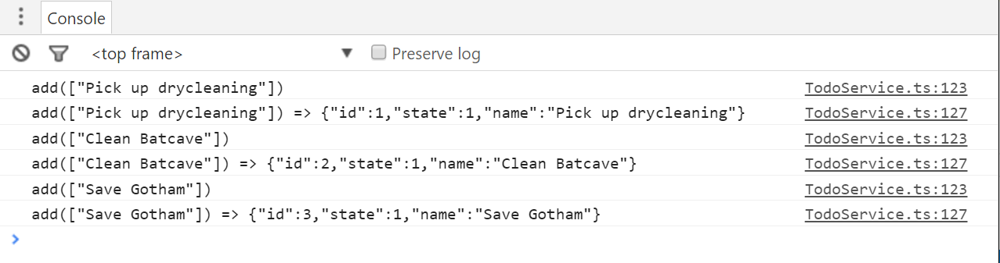
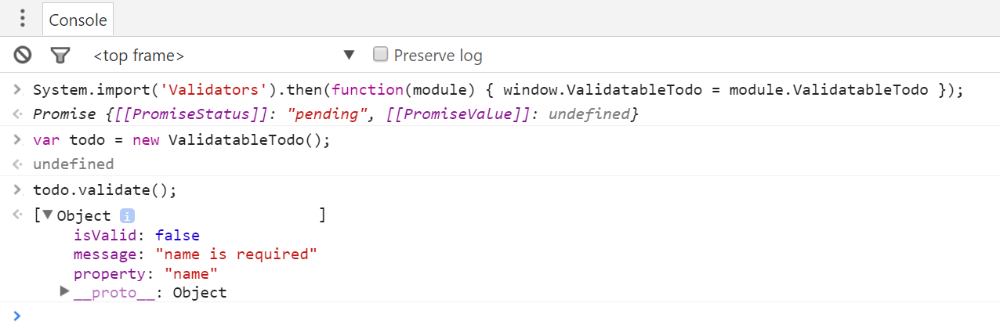
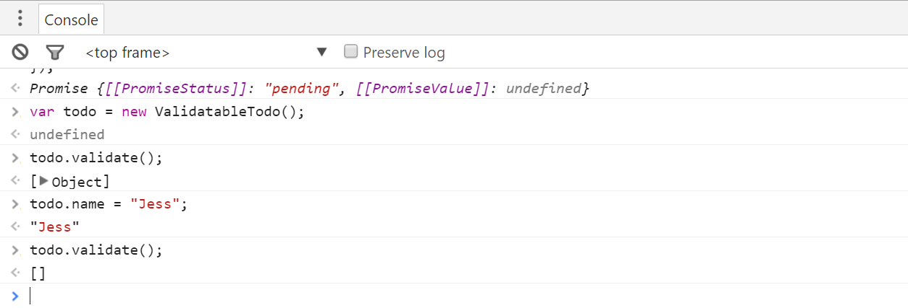
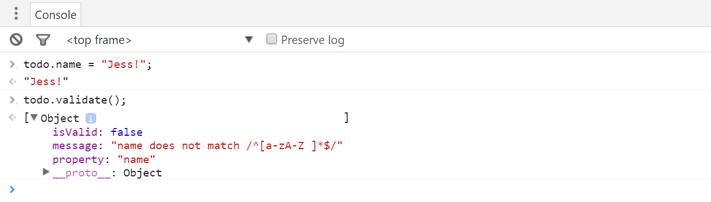
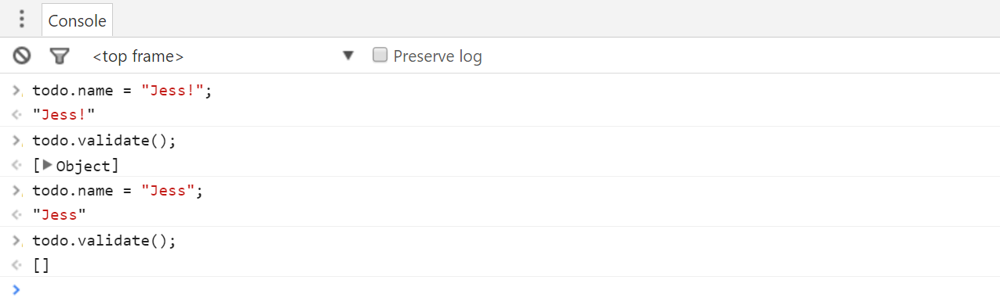

# Decorators {#decorators}

At this point in the book, I've shown you all the features that you'll need in order to leverage TypeScript in your day-to-day JavaScript development.  I also walked you through how to convert an existing JavaScript application into TypeScript as well as how to debug TypeScript applications in the browser.  Even though I've explained enough for you to be very productive with TypeScript, I've still got one last feature to show you in this chapter and that is **decorators**.  

Decorators are a *proposed* ECMAScript syntax that allow you to implement the Decorator design pattern to modify the behavior of a class, method, property, or parameter in a declarative fashion.  This powerful approach allows you to define common behavior in a central place and easily apply it across your application to reduce duplicate code and make your code more readable and maintainable all at the same time.

For instance, let's say I want to log every single time a method is called and after it's done executing.  If I were to do this with normal, imperative, inline code it'd look something like this:

    add(input): Todo {
        console.log(`add(${JSON.stringify(input)})`);
        // Add Todo        
        console.log(`add(${JSON.stringify(input)}) => ${JSON.stringify(todo)}`);

        return todo;
    };
	
You don't need TypeScript to apply the Decorator design pattern to this problem.  If you really wanted to add the logging logic without changing the code inside of the `add` method, you could wrap the original method in another method.

For example, you can start like this:

	var originalMethod = TodoService.prototype.add;
	
	TodoService.prototype.add = function (...args) {
	    let returnValue = originalMethod.apply(this, args);
	    return returnValue;
	}
	
This is your basic method decorator pattern - it replaces the original method with another method that duplicates the original method's behavior by actually calling that method and returning its result.

Once I have this basic structure in place, I can now start adding logic before and after the original method is called, like this:

{id='decorator-pattern-complete',title='Decorator pattern in action', linenos=on}
~~~
var originalMethod = TodoService.prototype.add;

TodoService.prototype.add = function (...args) {
    
    console.log(`add(${JSON.stringify(args)})`)
    
    let returnValue = originalMethod.apply(this, args);

    console.log(`add(${JSON.stringify(args)}) => ${JSON.stringify(returnValue)}`)
    
    return returnValue;
}
~~~

Here I've added two logging statements, one on line 5 right at the entry into the call and the other on line 9, after the original method has been called but before I return the value that the original method returned.  This approach even allows me to include the return value in my log statements.

The net result of all of this is a method that wraps another method, allowing me to attach behavior to the method while keeping the logic defined in the original method completely unchanged.  Used appropriately, this approach can be incredibly powerful.

Ok, so that's an example of the decorator pattern.  Now let's see ECMAScript Decorators in action.  

In order to apply a decorator to a method, you simply apply an `@` followed by the decorator name in front of the member that you want to decorate, like this:

	@log
	add(input): Todo {
	
Here I've told ECMAScript to attach the behavior defined in a method decorator named `log` to the `add` method -- a method decorator that is going to have the same exact logic that I just showed a minute ago.

What's a decorator?  Well, it's just a function with a special signature.  As I mentioned earlier, ECMAScript Decorators support four different targets - classes, methods, properties, and parameters - and their signatures look like this:

	declare type ClassDecorator = <TFunction extends Function>(target: TFunction) => TFunction | void;
	declare type PropertyDecorator = (target: Object, propertyKey: string | symbol) => void;
	declare type MethodDecorator = <T>(target: Object, propertyKey: string | symbol, descriptor: TypedPropertyDescriptor<T>) => TypedPropertyDescriptor<T> | void;
	declare type ParameterDecorator = (target: Object, propertyKey: string | symbol, parameterIndex: number) => void;

By the way, if you're wondering how I got to this definition, it's one of the core definitions that ships with TypeScript so I just created a variable with one of these names
	
	var x: ClassDecorator
	
Then, selected the type and said "Go to Definition", which brought me here.

I'll show you how to create and use each of these decorators in this chapter, but in this section, I'll start by showing you how to implement a method decorator and which looks like this:

	function log(target: Object, methodName: string, descriptor: TypedPropertyDescriptor<Function>)
	
* The `target` parameter is the object that the member lives on -- in this example, it'll be an instance of a TodoService.
* The `methodName` parameter is the name of the method to be decorated
* And, finally, the `descriptor` is an object that contains all of the metadata for the method that you're looking to modify. 

The descriptor object has a handful of properties that describe the member being decorated, but in this case the one I'm really looking for is the `value` property which is the method itself.

Remember that [Decorator pattern example](#decorator-pattern-complete) I just showed you?  Well, `descriptor.value` is really just the value of the `originalMethod` method in my previous example!

That means that I can just copy that code into this log decorator function and modify it a bit, changing the references from `TodoService.add` to `descriptor.value` instead...

	function log(target: Object, methodName: string, descriptor: TypedPropertyDescriptor<Function>) {
        
        var originalMethod = descriptor.value;
        
        descriptor.value = function (...args) {
            console.log(`TodoService.add(${JSON.stringify(args)})`)
            
            let returnValue = originalMethod.apply(this, args);
        
            console.log(`TodoService.add(${JSON.stringify(args)}) => ${JSON.stringify(returnValue)}`)
            
            return returnValue;
        }
        
	}
	
Of course, I'll need to change the hard-coded method name to make this decorator say the name of the method that's being wrapped, but that's pretty easy:

	`${methodName}(${JSON.stringify(args)})`

And that's how you write and your own method decorator!

However, there is one thing stopping me from running this code right now...  If I hover over the decorator, I can see that TypeScript is giving me an error.  This is because, while TypeScript does allow you to create and consume decorators, they are still just an ECMAScript proposal at the time of this writing, so the compiler takes a very conservative approach and will refuse to allow the use of decorators unless you to opt-in to the functionality by setting a compiler flag.  

That means that in order to get this to compile property, I'll need to open up the `tsconfig.json` file and set the `"experimentalDecorators"` flag to `true`.

{title="tsconfig.json"}
~~~
{
    "compilerOptions": {
        "experimentalDecorators": true
    }
}
~~~

With that setting in place, the TypeScript error goes away, I can compile my code, and run my application to see my new decorator in action.

Pretty cool, huh?  Well, if you think that's cool, what if I told you that in addition to being able to decorate methods, you can also define decorators for properties, accessors, classes, and even method parameters!  What's more, they're all just variations of the method decorator function that I implemented in this section.  So, if you're interested in seeing how to create these other types of decorators and use them to easily  and effectively add dynamic behavior throughout your application, please check out the rest of this chapter!

## Implementing Class Decorators  {#class-decorators}

In the previous section, I introduced you to the concept of decorators and even showed you how to use them in order to quickly and easily add logic that executed before and after a method -- without modifying the code in the method itself!  In the rest of this chapter, I'm going to show you how to create and apply class and property decorators to implement a mini validation framework to enable runtime-checking of property and parameter values.  And in this section I'll start with the easiest one:  the class decorator.

I'll start by creating a new TypeScript file to hold everything and import my model types.

{title="Validators.ts"}
~~~
import {Todo, TodoState} from './Model';
~~~
	
Then, I'll create a class that implements the `Todo` interface so that I have something to decorate.
	
{title="Validators.ts"}
~~~
export class ValidatableTodo implements Todo {
    
    id: number;
    name: string;
    state: TodoState;
    
}
~~~
	
Just as method decorators are used to decorate a method, class decorators decorate a class -- in other words, the can be used to modify the class's constructor function and its prototype members after the class has been defined.

One good example of using class decorators is to dynamically attach methods to a class definition.  For example, let's say that I want to define one single `validate` method and be able to attach it to any class in my application.

Let's see what it'd look like if I did this manually, without decorators.

First, I'd create the validate function itself:

{linenos=on}
	export function validate() {
        
	    let validators = [].concat(this._validators),
	        errors = [];
	    
	    for(let validator of validators) {
	        let result = validator(this);
	        
	        if(!result.isValid) {
	            errors.push(result);
	        }
	    }
	    
	    return errors;
	}
	
This function just tries to find an array of validators on the current instance and then iterates through them, calling each one and looking at its result.  If the result is not valid, I add it to the list of errors and then return all the errors at the end.  Notice how I used the `array.concat` method on line 3 to get the array of validators.  The `array.concat` method accepts null or undefined values which means that if no validators have been registered, this array will simply be empty and I won't have to do any null checks.

And, actually, since this is a TypeScript book, let me add some types in here:

	export interface IValidatable {
	    validate(): IValidationResult[];
	}
	
	export interface IValidationResult { 
	    isValid: boolean; 
	    message: string; 
	    property?: string;
	}
	
	export interface IValidator {
	    (instance: Object): IValidationResult;
	}
	
	export function validate() {
	    let validators: IValidator[] = [].concat(this._validators),
	        errors: IValidationResult[] = [];
	    
	    for(let validator of validators) {
	        let result = validator(this);
	        
	        if(!result.isValid) {
	            errors.push(result);
	        }
	    }
	    
	    return errors;
	}

Now that I have my `validate` function, let's go ahead and add it to a class by assigning it to the class's prototype.

	ValidatableTodo.prototype._validators = [];
	ValidatableTodo.prototype.validate = validate;
	
Ok, if that's how you'd attach behavior using the Decorator pattern *without* the decorator syntax, let's see how I can use a decorator `to accomplish this same thing in a little bit cleaner way...

Just like the method decorator function, I'll start with a function that just has one parameter:  the class's constructor function.

	export function validatable(target: Function) {
	}
	
And inside this function I can apply the same exact logic I just applied to the `ValidatableTodo` class, but in a more generic way:

	export function validatable(target: Function) {
	        target.prototype.validate = validate;
	    
	}
	
Now, I can apply this decorator to any class using the same exact syntax used to decorate a method:

	@validatable
	export class ValidatableTodo implements Todo {
	    
	    id: number;
	    name: string;
	    state: TodoState;
	    
	}
	
And, since the `validatable` decorator adds the `validate` method dynamically, I can let TypeScript know that this class now implements the `IValidatable` interface by adding a merged declaration that says exactly that:

	export interface ValidatableTodo extends IValidatable {
	}
	
Then, to try it out, I can refactor the `add` method on the `TodoService` to use this new class to validate new `Todo`s as they are created:

{title="TodoService.ts"}
~~~
import { ValidatableTodo } from './Validators';
~~~

{title="TodoService.ts"}
~~~
# leanpub-start-insert
let todo = new ValidatableTodo();
todo.id = generateTodoId();
todo.state = TodoState.Active;
# leanpub-end-insert

if (typeof input === 'string') {
    todo.name = input;
}
else if (typeof input.name === 'string') {
    todo.name = input.name;
} else {
    throw 'Invalid Todo name!';
}

# leanpub-start-insert
let errors = todo.validate();

if(errors.length) {
    let combinedErrors = errors.map(x => `${x.property}: ${x.message}`) 
    throw `Invalid Todo! ${errors.join('; ')}`;
}
# leanpub-end-insert
~~~
	
With this new logic in place, all of my `Todo` objects will be validated with the various rules that I'll apply to the `ValidatableTodo` class in the rest of this chapter.

Speaking of which, let's move on to the next section where I'll show you how to use property decorators to add this validation logic!

## Implementing Property Decorators {#property-decorators}

In the previous few sections, I showed you how to create decorator functions that you could use to decorate methods and classes.  In this section, I'm going to show you how to implement property decorators that will allow you to dynamically add behavior to your properties.

The signature of a property decorator is right in between a class decorator and a method decorator:  

	function required(target: Object, propertyName: string) {
	
It takes two parameters: the target object and the name of the property on that object.
	
Then, within this function I can define the logic that I want to execute any time the property decorator is applied to a property.

In this instance, what I want to do is add a validation function to the list of validators on the target object.  So, first, I'll need to get a reference to that list of validators like this:

{linenos=on}
	function required(target: Object, propertyName: string) {
	    
	    let validatable = <{ _validators: IValidator[] }>target, 
	        validators = (validatable._validators || (validatable._validators = []));
	
	}
    
Notice how I'm using an anonymous type on line 3 so that I can still get the benefits of typing just in this method even though this isn't an formally-defined type.
	
Then, I can define and add a validation function to this list.  

	function required(target: Object, propertyName: string) {
	
	    let validatable = <{ _validators: IValidator[] }>target, 
	        validators = (validatable._validators || (validatable._validators = []));

        #leanpub-insert-start	    
	    validators.push(function (instance) {
	    });
        #leanpub-insert-end	    
	}

I'll start by getting the value of the property for this particular instance:

	function required(target: Object, propertyName: string) {
	
	    let validatable = <{ _validators: IValidator[] }>target, 
	        validators = (validatable._validators || (validatable._validators = []));
	    
	    validators.push(function (instance) {
        #leanpub-insert-start	    
	        let propertyValue = instance[propertyName];
        #leanpub-insert-end	    
	    });
	}
	
Then, since this decorator is enforcing the fact that the property must have a value, I'll check that property value to make sure it's assigned to something, and - if it's a string - that it contains at least one character.

    validators.push(function (instance) {
        let propertyValue = instance[propertyName],
        #leanpub-insert-start	    
            isValid = propertyValue != undefined;

        if (typeof propertyValue === 'string') {
            isValid = propertyValue && propertyValue.length > 0;
        }
        #leanpub-insert-end	    
    });
	
	
And, finally, I'll return an object literal that meets the contract defined by the `IValidationResult` interface:

	function required(target: Object, propertyName: string) {
	
	    let validators: IValidator[] = (target._validators || (target._validators = []));
	    
	    validators.push(function (instance) {
	        let propertyValue = instance[propertyName],
	            isValid = propertyValue != undefined;
	
	        if (typeof propertyValue === 'string') {
	            isValid = propertyValue && propertyValue.length > 0;
	        }
	        
        #leanpub-insert-start	    
		    return { 
                isValid, 
                message: `${propertyName} is required`,
                property: propertyName 
            };
        #leanpub-insert-end	    
	    });
	}
	
Now that I've defined the property decorator, I can go ahead and add it to my property, using the same syntax that I used for the method and class decorators in the previous sections:  the `@` character, followed by the decorator function name:

	@validatable
	export class ValidatableTodo implements Todo {
	
	    id: number;
	    
	    @required
	    name: string;
	    
	    state: TodoState;
	
	}
	
With all that in place, I can run the site and try to add an empty todo item to see the new validation in action.   

Of course, if I try to add a value that actually has some characters in it, it goes through just fine...

	
It's probably best to point out that if this were a real application I wouldn't be throwing an error like this -- instead, I'd send the error objects up to the view and display them to the user so they have some idea of what properties are invalid and why.  However, all of that is just slightly outside of the scope of this book.

But, you know what's *not* outside of the scope of this book? The next section, where I'll show you how to pass parameters into a decorator using a pattern called a decorator factory.

## Implementing Decorator Factories

So far in this chapter I have shown you how to create and apply class, method, and property decorators and, until now, all of the decorators I've shown you have been functions whose parameters are the things they are decorating - for example, class constructors, methods, or properties, such as this property decorator:

	function regex(target: Object, propertyName: string) {
	}
	
But, what if you wanted to pass a parameter to one of those decorator functions?  In the case of this decorator, what if I wanted to pass a regex string that I could execute in order to validate the property value?

Well, that wouldn't work because decorators need to have a specific signature and don't leave any room for other parameters.  In cases like these you need a **decorator factory**.

The concept of a decorator factory is actually quite simple:  it's a function that returns a decorator function.  In other words, the factory function itself doesn't have to match the signature of, say, a property decorator - it just needs to return a function with a signature that matches a property decorator... like this:

	function regex(pattern: string, flags?: string) {
	
		return function (target: Object, propertyName: string) {
		}
	
	}
	
And, as with any other inner JavaScript function, the decorator function created inside of the decorator factory has full access to any of the parameters passed into the decorator factory function itself.

In other words, take the `pattern` parameter that's passed into the decorator factory -- I'll have access to that inside of the decorator function to validate the value of the property at runtime.  So, if I make a copy of the `required` validator from before...

	function regex(pattern: string, flags?: string) {
	    
		return function (target: Object, propertyName: string) {
	
		    let validators: IValidator[] = (target._validators || (target._validators = []));
		
		    validators.push(function(instance) {
		        let propertyValue = instance[propertyName],
		            isValid = propertyValue != undefined;
		
		        return {
		            isValid,
		            message: `${propertyName} is required`,
		            property: propertyName
		        };
		    });
		
		}
	}

I can modify the validation logic from checking for an undefined property value to checking to see if the property value is a string that matches the regular expression:

	function regex(pattern: string, flags?: string) {
	    
	    let expression = new RegExp(pattern, flags);
	
	    return function(target: Object, propertyName: string) {
	
	        let validators: IValidator[] = (target._validators || (target._validators = []));
	
	        validators.push(function(instance) {
	            let propertyValue = instance[propertyName],
	                isValid = expression.match(propertyValue);
	
	            return {
	                isValid,
	                message: `${propertyName} does not match ${expression}`,
	                property: propertyName
	            };
	        });
	
	    }
	
	}
	
Then I use this new decorator factory almost exactly as I use a normal decorator function, except that I call it as a function with parentheses and pass in parameters.

For instance, if I wanted to make sure that the `name` property only included alpha-numeric characters or spaces, I could apply the new decorator factory with this regular expression:

	@validatable
	export class ValidatableTodo implements Todo {
	
	    id: number;
	
	    @required
	    @regex(`^[a-zA-Z ]*$`)
	    name: string;
	
	    state: TodoState;
	
	}

And, yes - it's totally valid to apply multiple decorators to a single property, class, or method!

With this in place, I can run the site and if I give the name property a value - but that value has non-alphanumeric characters -  I can see my new regex validator kicking in!

	
And, of course, if I update the name property to include only alphanumeric characters, I no longer get any validation errors.

Frankly, I found decorator factories a bit awkward at first -- a function that returns a decorator function can seem pretty weird.  But, the approach grew on me and now I use both decorators and decorator factories on a regular basis to centralize all of the cross-cutting concerns in my application such as logging and validation.  I have even used decorators to implement far more complex concepts such as dependency injection!  I consider decorators to be a great help and I'm willing to bet that once you start using them, it's going to be hard for you to stop!